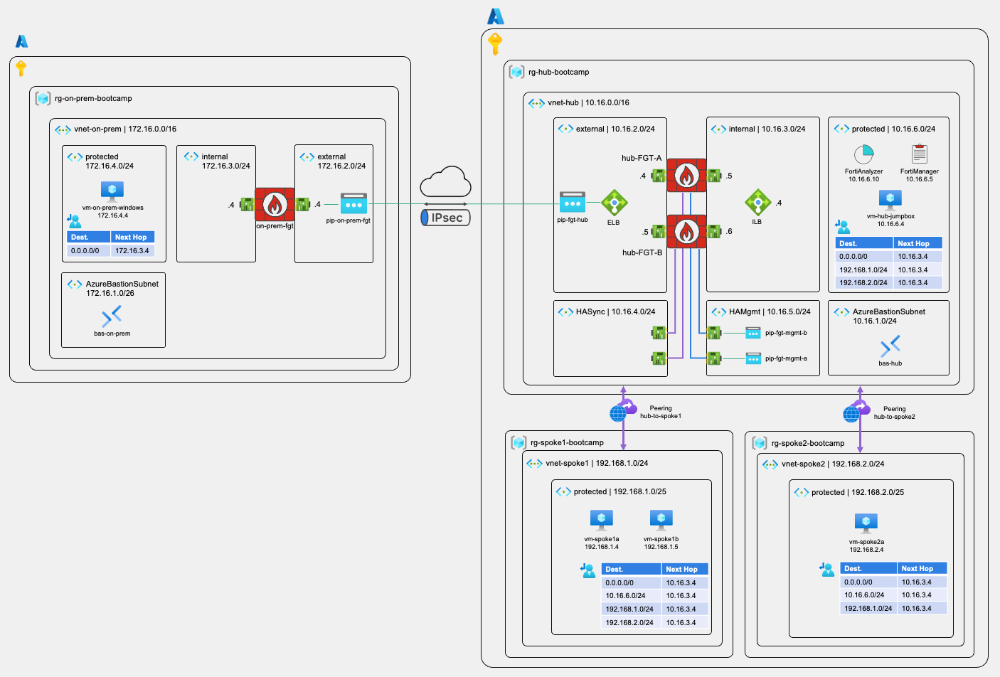

# Fortinet Security Fabric Azure Bootcamp

## From Edge to Cloud: Building resilient Azure security with hybrid connectivity

### Welcome!

Organizations need resilient security solutions that protect both cloud and on-premises assets while maintaining operational continuity. This bootcamp provides practical skills for building enterprise-ready security infrastructure that ensures high availability, centralized visibility, and seamless connectivity across hybrid environments. You'll gain hands-on experience with real-world deployment scenarios critical for modern cybersecurity professionals by building a complete security fabric featuring high-availability FortiGate clusters, with FortiManager and FortiAnalyzer, and hybrid connectivity.

### Time Requirements

The estimated time to complete this bootcamp is 5 - 6 hours.

### Target Audience

- Cloud security engineers and architects
- Network security professionals transitioning to cloud
- Fortinet administrators expanding to Azure
- DevOps/SecOps engineers managing hybrid environments
- IT professionals implementing enterprise security solutions
- Security consultants and presales engineers
- System administrators responsible for firewall management

**Experience Level**: Intermediate to advanced professionals with networking fundamentals and basic Azure knowledge.

### What You'll Learn:

- Deploy FortiGate firewalls in Active-Passive HA configuration using Azure Load Balancers
- Configure FortiAnalyzer for centralized logging and analytics
- Set up FortiManager for unified policy management
- Establish secure site-to-site VPN connectivity between on-premises and Azure environments
- Implement best practices for cloud security architecture and hybrid networking

### Reference Architecture

After completing this bootcamp, you will have deployed the following architecture.

## Modules

This bootcamp is organized in sequential modules. One module will build up on top of the previous module, so please, follow the order as proposed below.

Module 1 - [Getting Started: Azure Environment Setup and Verification](/modules/module-01-getting-started/README.md)    
Module 2 - [Hub Network Infrastructure: Creating the Hub vNET with Azure Bastion](/modules/module-02-hub-setup/README.md)  
Module 3 - [Spoke Networks Infrastructure: Creating Spoke1 and Spoke2 vNETs with Workload VMs](/modules/module-03-spokes-setup/README.md)  
Module 4 - [VNet Peering and Connectivity Testing: Connecting Hub and Spoke Networks](/modules/module-04-peering-testing/README.md)  
Module 5 - [Simulated On-Premises Environment: Setting Up Your On-Premise Environment](/modules/module-05-on-prem-environment/README.md)
Module 6 - [FortiGate HA Deployment: Deploy FortiGate Firewalls in Active-Passive HA with Load Balancers](/modules/module-06-fortigate-ha-deployment/README.md)  
Module 7 - [User-Defined Routes (UDRs): Configuring Traffic Flow Through FortiGate Firewalls](/modules/module-07-configuring-udrs/README.md)  
Module 8 - [FortiGate Configuration and Traffic Testing: Testing and Configuring FortiGate Security Policies](/modules/module-08-fortigate-config-test/README.md)  
Module 9 - [Site-to-Site IPSec VPN: Connecting On-Premises and Azure Environments](/modules/module-09-site-to-site-vpn/README.md)  
Module 10 - [FortiAnalyzer Deployment: Centralized Logging and Analytics](/modules/module-10-fortianalyzer/README.md)  
Module 11 - [FortiManager Deployment: Centralized Security Management and Policy Orchestration](/modules/module-11-fortimanager/README.md)  
Module 12 - [Environment Cleanup: Removing All Bootcamp Resources](/modules/module-12-cleanup/README.md)  
  
---

> [!NOTE]
> The workshop provides examples and sample code as instructional content for you to consume. These examples will help you understand how to configure Calico Cloud and build a functional solution. Please note that these examples are not suitable for use in production environments.

> [!WARNING] 
> If you are using a subscription in your production environment, it would be more prudent not to use your "Global Admin" account. Although the lab is designed to function in "isolated" mode, a "human" error when creating certain resources ("peering", routing table, ...) could impact your production environment. We recommend using your standard account on an isolated subscription.

> [!CAUTION] 
> This lab uses several virtual machines. The entire lab should stay under $30. At the end of the day, it will be important to delete everything or at least stop the VMs if you don't want any unpleasant surprises.