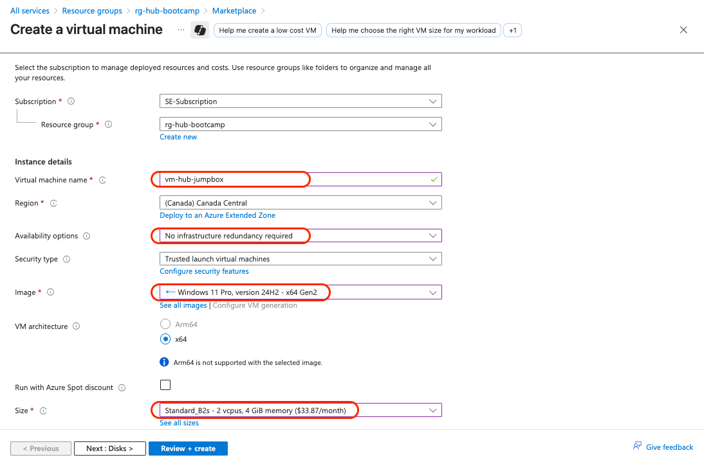
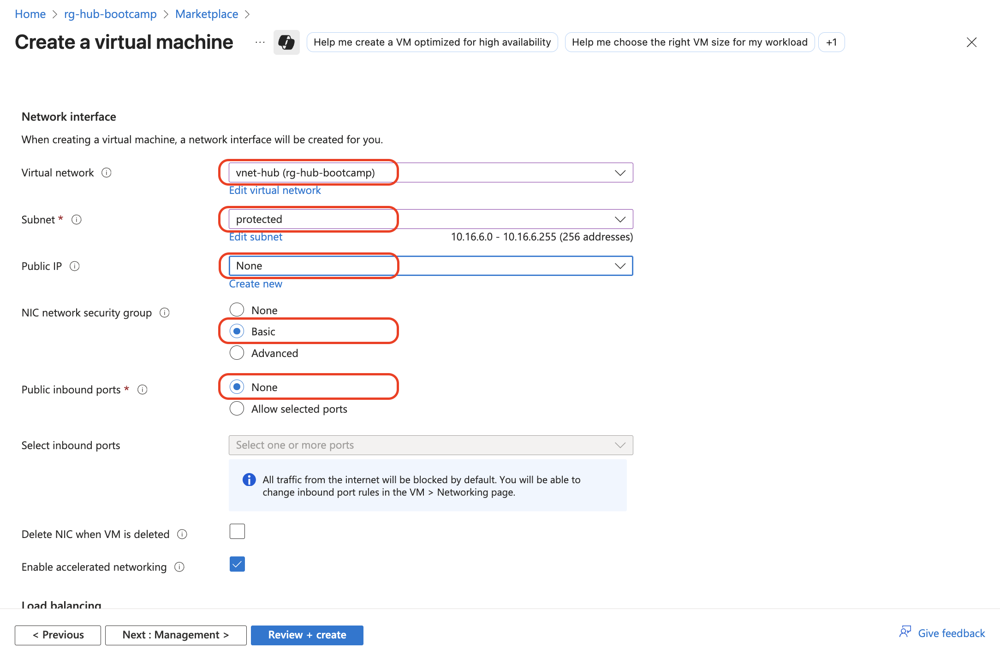

# Module 2 - Hub Network Infrastructure

## Creating the Hub Virtual Network with Azure Bastion

### Overview
In this module, we'll create the foundational hub network infrastructure including the virtual network, subnets, Azure Bastion for secure access, and a jumpbox virtual machine for testing connectivity.

### Learning Objectives
By the end of this module, you will have:
- Created the hub virtual network with proper addressing
- Deployed Azure Bastion for secure remote access
- Created a jumpbox VM for connectivity testing
- Established secure connectivity to the jumpbox via Bastion

---

## Step 1: Create the Hub Virtual Network

### 1.1 Navigate to Resource Group
1. In the Azure Portal, go to **Resource groups**
2. Click on **`rg-hub-bootcamp`**
3. Click **"+ Create"** to add a new resource

### 1.2 Search for Virtual Network
1. In the **Marketplace** search field, type: **`virtual network`**
2. Click on **"Virtual Network"** (Microsoft service)
3. Click **"Create"**


### 1.3 Configure Basic Settings
1. **Basics** tab configuration:
   - **Subscription**: Your subscription
   - **Resource group**: `rg-hub-bootcamp`
   - **Name**: `vnet-hub`
   - **Region**: `Canada Central`
2. Click **"Next: Security"**


> [!NOTE]
> **Naming Convention**: We're following Azure Cloud Adoption Framework naming standards. `vnet` = Virtual Network, `rg` = Resource Group, `bas` = Bastion, `pip` = Public IP, `vm` = Virtual Machine.

---

## Step 2: Configure Azure Bastion

### 2.1 Enable Azure Bastion
1. In the **Security** tab, check **"Enable Azure Bastion"**
2. Configure Bastion settings:
   - **Bastion name**: `bas-hub`
   - Click the blue link **"Create a public IP address"**
   - **Public IP name**: `pip-bas-hub`
   - Click **"OK"**
3. Click **"Next: IP Addresses >"**


---

## Step 3: Configure IP Address Ranges

### 3.1 Set Virtual Network Address Space
1. In the **IP Addresses** tab:
   - **IPv4 address space**: `10.16.0.0/16`

### 3.2 Configure Subnets
1. **Edit the default subnet**:
   - Click on the **"default"** subnet
   - **Subnet name**: `protected`
   - **Subnet address range**: `10.16.6.0/24`
   - Click **"Save"**


2. **Bastion subnet** (should be automatically created):
   - **Name**: `AzureBastionSubnet` (fixed name, cannot be changed)
   - **Address range**: `10.16.1.0/24`


### 3.3 Review and Create
1. Click **"Review + create"**
2. Review all settings
3. Click **"Create"**

> [!TIP]
> The Bastion deployment may take 5-10 minutes. This is normal for Bastion services.

---

## Step 4: Create the Jumpbox Virtual Machine

### 4.1 Start VM Creation
1. Open a **new browser tab** and navigate to your **`rg-hub-bootcamp`** resource group
2. Click **"+ Create"**
3. Search for: **`virtual machine`**
4. Select **"Virtual machine"** and click **"Create"**


### 4.2 Configure VM Basics
1. **Basics** tab configuration:
   - **Virtual machine name**: `vm-hub-jumpbox`
   - **Region**: `Canada Central`
   - **Availability options**: `No infrastructure`
   - **Image**: `Windows 11 Pro, Version 24H2 - x64 Gen2`
   - **Size**: `Standard_D2s_v3 - 2 vcpus, 8 GiB memory`



### 4.3 Configure Authentication
1. **Authentication type**: `Password`
2. **Username**: `azureuser`
3. **Password**: Create a strong password (save it securely!)
4. **Confirm password**: Re-enter your password
5. **Public inbound ports**: `None` ⚠️ **IMPORTANT**


### 4.4 Configure VM Disks
1. Click **"Next: Disks >"**
2. Keep default disk configurations (Premium SSD, Image default (127 GiB))
3. Click **"Next: Networking >"**

### 4.5 Configure VM Networking
1. **Networking** tab configuration:
   - **Virtual network**: `vnet-hub`
   - **Subnet**: `protected (10.16.6.0/24)`
   - **Public IP**: `None` ⚠️ **IMPORTANT**
   - **NIC network security group**: `Basic`
   - Keep other default settings



2. Click **"Review + create"**
3. Click **"Create"**

> [!NOTE]
> VM creation typically takes 3-5 minutes. The VM will have no public IP address - we'll access it through Bastion for security.

---

## Step 5: Test Bastion Connectivity

### 5.1 Connect to the Jumpbox VM
1. Once the VM deployment is complete, click **"Go to resource"**
2. In the VM overview page, click **"Connect"**
3. Select **"Connect via Bastion"**

### 5.2 Authenticate via Bastion
1. **Connection Settings**:
   - **Authentication Type**: `VM Password`
   - **Username**: `azureuser`
   - **Password**: Enter the password you created
2. Click **"Connect"**


> [!TIP]
> If a popup blocker prevents the Bastion window from opening, allow popups for the Azure Portal domain.

### 5.3 Verify Connection
1. A new browser tab should open with a Remote Desktop session
2. You should see the Windows 11 desktop
3. Test basic connectivity by opening Command Prompt and running:
   ```cmd
   ipconfig
   ping 8.8.8.8
   ```


---

## Verification Checklist

Before proceeding to Module 3, verify you have completed:

- [ ] Created `vnet-hub` with address space `10.16.0.0/16`
- [ ] Configured `protected` subnet with `10.16.6.0/24`
- [ ] Deployed Azure Bastion (`bas-hub`) with `AzureBastionSubnet`
- [ ] Created `vm-hub-jumpbox` with no public IP
- [ ] Successfully connected to the jumpbox via Bastion
- [ ] Verified internet connectivity from the jumpbox

---

## Troubleshooting Common Issues

### Issue: Bastion deployment takes too long
**Solution**: Bastion deployments can take up to 10 minutes. Be patient and don't cancel the deployment.

### Issue: Can't connect via Bastion
**Solution**: 
- Ensure popup blockers are disabled for Azure Portal
- Verify the VM is running (not stopped)
- Double-check username/password credentials

### Issue: Subnet overlap errors
**Solution**: Ensure address ranges don't overlap and are within the VNet address space.

---

## Architecture Review

After completing this module, your hub infrastructure should look like this:

```text
rg-hub-bootcamp
├── vnet-hub (10.16.0.0/16)
│   ├── protected subnet (10.16.6.0/24)
│   │   └── vm-hub-jumpbox (Windows 11, Private IP only)
│   └── AzureBastionSubnet (10.16.1.0/24)
│       └── bas-hub (with pip-bas-hub)
```

---

## Next Steps

Once you've completed this module and verified all components are working, you're ready to proceed to **Module 3: Spoke1 Network Infrastructure**.

**Estimated completion time**: 20-25 minutes

> [!NOTE]
> Keep the Bastion connection tab open - you'll need it for testing connectivity in upcoming modules.