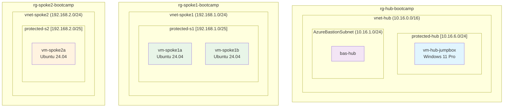

# Module 3 - Spoke Networks Infrastructure

## Creating Spoke1 and Spoke2 Virtual Networks with Workload VMs

### Overview
In this module, we'll create two spoke networks that will connect to our hub network. Each spoke will have its own virtual network, subnet, and virtual machines to simulate workload environments.

### Learning Objectives
By the end of this module, you will have:
- Created two spoke virtual networks with proper addressing
- Deployed workload virtual machines in each spoke
- Established the foundation for hub-spoke network topology

---

## Part A: Create Spoke1 Network and VMs

### Step 1: Create Spoke1 Virtual Network

#### 1.1 Navigate to Spoke1 Resource Group
1. Open a **new browser tab** and go to **Resource groups**
2. Click on **`rg-spoke1-bootcamp`** (created in Module 1)
3. Click **"+ Create"** to add a new resource

#### 1.2 Create Virtual Network
1. Search for: **`virtual network`**
2. Select **"Virtual Network"** and click **"Create"**
3. **Basics** tab configuration:
   - **Subscription**: Your subscription
   - **Resource group**: `rg-spoke1-bootcamp`
   - **Name**: `vnet-spoke1`
   - **Region**: `Canada Central`

#### 1.3 Skip Security Features
1. Click **"Next: Security >"**
2. **Do not enable Azure Bastion** (we'll use the hub Bastion)
3. Click **"Next: IP Addresses >"**

#### 1.4 Configure IP Address Ranges
1. **IPv4 address space**: `192.168.1.0/24`
2. **Edit the default subnet**:
   - Click on the **"default"** subnet
   - **Subnet name**: `protected`
   - **Subnet address range**: `192.168.1.0/25`
   - Click **"Save"**
3. Click **"Review + create"** then **"Create"**

---

### Step 2: Create First Spoke1 VM

#### 2.1 Start VM Creation
1. Once VNet deployment completes, open a **new browser tab**
2. Navigate to **`rg-spoke1-bootcamp`** resource group
3. Click **"+ Create"** and search for: **`virtual machine`**

#### 2.2 Configure VM Basics
1. **Basics** tab:
   - **Virtual machine name**: `vm-spoke1a`
   - **Region**: `Canada Central`
   - **Availability options**: `No infrastructure redundancy required`
   - **Image**: `Ubuntu Server 24.04 LTS - x64 Gen2`
   - **Size**: `Standard_D2s_v3 (2 vcpus, 8 GiB memory)`

#### 2.3 Configure Authentication
1. **Authentication type**: `Password`
2. **Username**: `azureuser`
3. **Password**: Create a strong password (save it securely!)
4. **Public inbound ports**: `None` ⚠️ **IMPORTANT**

#### 2.4 Configure Networking
1. Click **"Next: Disks >"** (keep defaults)
2. Click **"Next: Networking >"**
3. **Networking** configuration:
   - **Virtual network**: `vnet-spoke1`
   - **Subnet**: `protected (192.168.1.0/25)`
   - **Public IP**: `None` ⚠️ **IMPORTANT**
4. Click **"Review + create"** then **"Create"**

---

### Step 3: Create Second Spoke1 VM

#### 3.1 Create Second VM
1. Open a **new browser tab** and navigate to **`rg-spoke1-bootcamp`**
2. Click **"+ Create"** and search for: **`virtual machine`**

#### 3.2 Configure VM Settings
Use the **same configuration as vm-spoke1a** except:
- **Virtual machine name**: `vm-spoke1b`
- All other settings remain identical

> [!TIP]
> You can speed this up by keeping the previous VM creation tab open and copying the settings.

---

## Part B: Create Spoke2 Network and VM

### Step 4: Create Spoke2 Virtual Network

#### 4.1 Navigate to Spoke2 Resource Group
1. Open a **new browser tab** and go to **Resource groups**
2. Click on **`rg-spoke2-bootcamp`** (created in Module 1)
3. Click **"+ Create"**

#### 4.2 Create Virtual Network
1. Search for: **`virtual network`**
2. **Basics** tab configuration:
   - **Resource group**: `rg-spoke2-bootcamp`
   - **Name**: `vnet-spoke2`
   - **Region**: `Canada Central`

#### 4.3 Configure IP Addressing
1. Skip Security tab (no Bastion needed)
2. **IP Addresses** tab:
   - **IPv4 address space**: `192.168.2.0/24`
   - **Edit default subnet**:
     - **Subnet name**: `protected`
     - **Subnet address range**: `192.168.2.0/25`
3. Click **"Review + create"** then **"Create"**

---

### Step 5: Create Spoke2 VM

#### 5.1 Create VM
1. Navigate to **`rg-spoke2-bootcamp`** resource group
2. Click **"+ Create"** and search for: **`virtual machine`**

#### 5.2 Configure VM
Use the **same configuration as spoke1 VMs** except:
- **Virtual machine name**: `vm-spoke2a`
- **Virtual network**: `vnet-spoke2`
- **Subnet**: `protected (192.168.2.0/25)`

---

## Verification Checklist

Before proceeding to Module 4, verify you have created:

**Spoke1 Infrastructure:**
- [ ] `vnet-spoke1` with address space `192.168.1.0/24`
- [ ] `protected` subnet with `192.168.1.0/25`
- [ ] `vm-spoke1a` (Ubuntu, no public IP)
- [ ] `vm-spoke1b` (Ubuntu, no public IP)

**Spoke2 Infrastructure:**
- [ ] `vnet-spoke2` with address space `192.168.2.0/24`
- [ ] `protected` subnet with `192.168.2.0/25`
- [ ] `vm-spoke2a` (Ubuntu, no public IP)

**All VMs should have:**
- [ ] No public IP addresses
- [ ] Password authentication with `azureuser`
- [ ] Standard_B1s size
- [ ] Ubuntu Server 24.04 LTS

---

## Architecture Review

After completing this module, your infrastructure should look like this:

> [!NOTE]
> **Current State**: All networks are **isolated** - no connectivity between hub and spokes yet. We'll establish connectivity in Module 4 with VNet peering.

---

## Troubleshooting Common Issues

### Issue: Can't find the resource group
**Solution**: Ensure you're looking in the correct subscription and remember the resource groups were created in Module 1.

### Issue: VM deployment fails
**Solution**: 
- Check quota limits in Canada Central region
- Ensure you selected "None" for public IP
- Verify the correct VNet and subnet are selected

### Issue: Wrong subnet size
**Solution**: Remember that `/25` gives you ~126 usable IPs (plenty for a few VMs), while `/24` would be the entire spoke network.

---

## Next Steps

Once you've completed this module and verified all resources are created, you're ready to proceed to **Module 4: VNet Peering and Connectivity Testing**.

In Module 4, we'll connect these isolated networks together and test connectivity between the spokes through the hub.

**Estimated completion time**: 25-30 minutes

> [!TIP]
> Keep track of your VM passwords - you'll need them for connectivity testing in the next module!