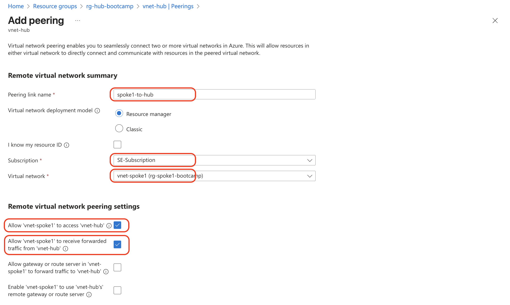
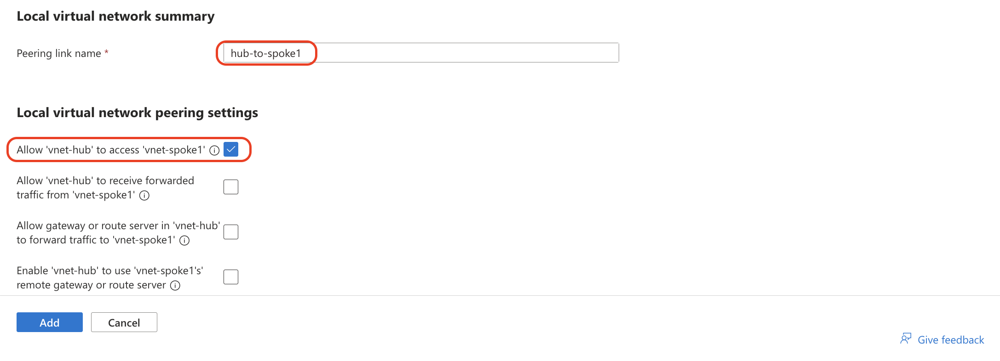
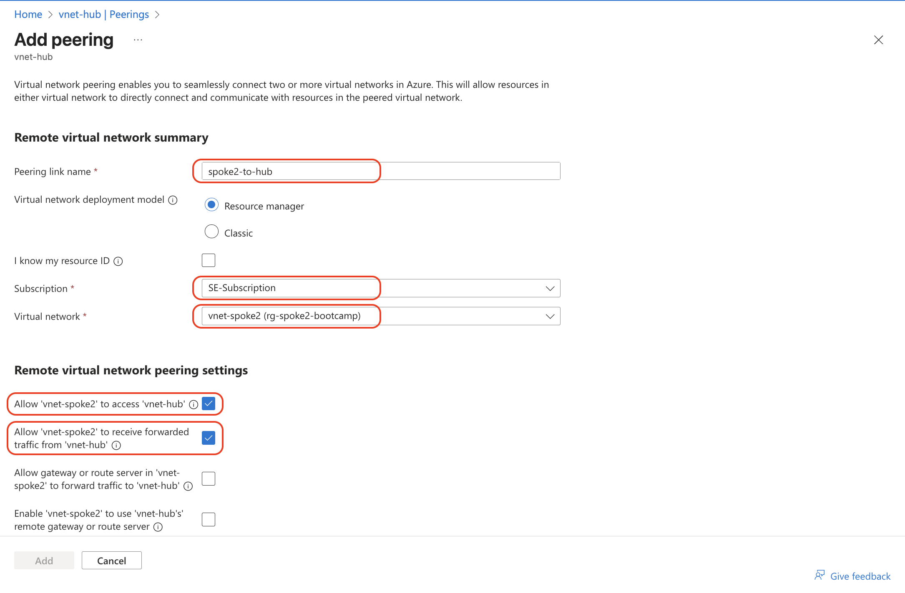
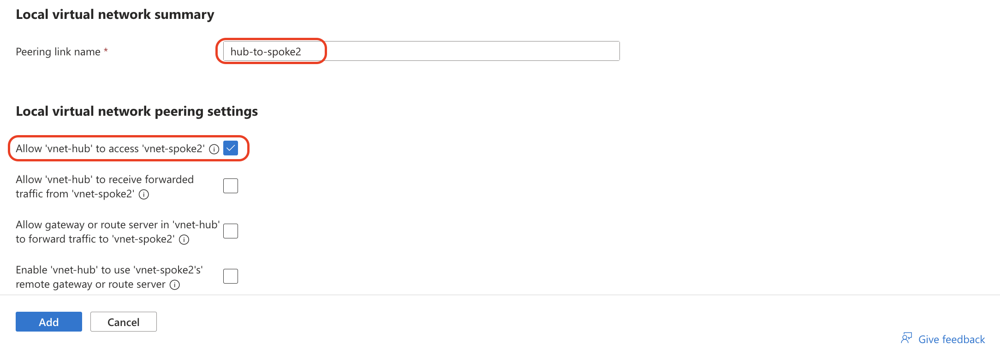
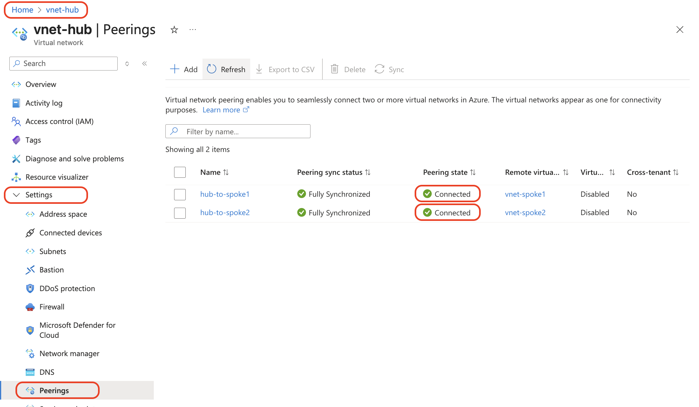
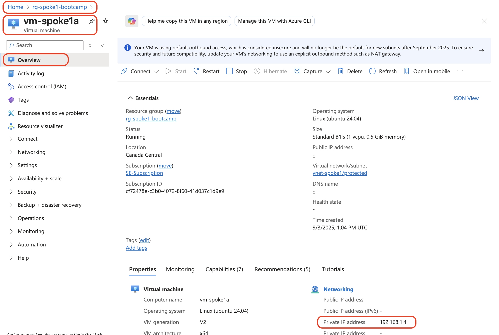
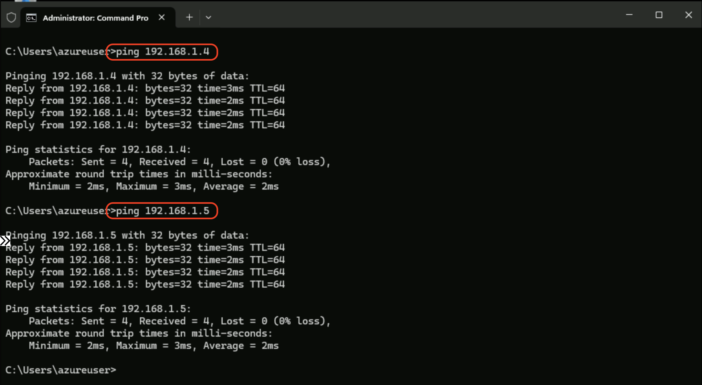
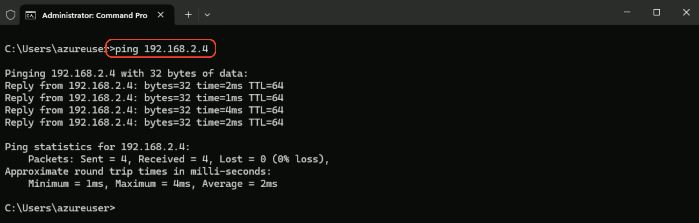
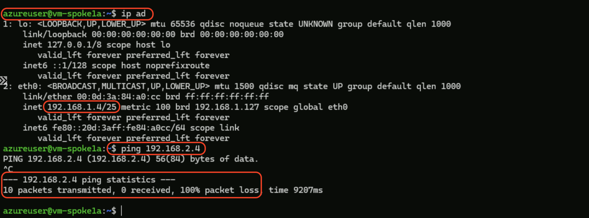
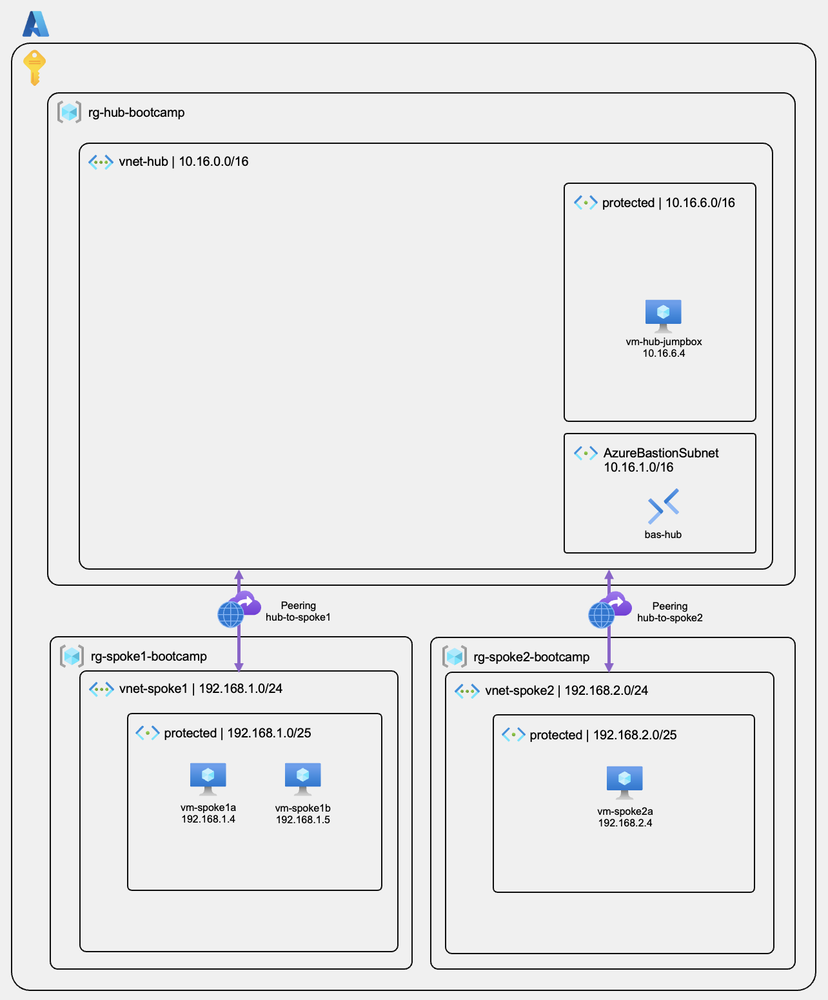

# Module 4 - VNet Peering and Connectivity Testing

## Connecting Hub and Spoke Networks

### Overview
Now that we have our hub and spoke networks created, we need to establish connectivity between them using Azure VNet Peering. This will create our hub-spoke topology and allow communication between networks.

### Learning Objectives
By the end of this module, you will have:
- Configured VNet peering between hub and spoke networks
- Established bidirectional connectivity
- Tested network connectivity between all VMs
- Verified the hub-spoke topology is working

---

## Step 1: Create Hub-to-Spoke1 Peering

### 1.1 Navigate to Hub VNet
1. Go to **Resource groups** → **`rg-hub-bootcamp`**
2. Click on **`vnet-hub`**
3. In the left menu, click **"Settings > Peerings"**


### 1.2 Configure Spoke1 Peering
1. Click **"+ Add"**
2. **Remote virtual network summary** (top section):
   - **Peering link name**: `spoke1-to-hub`
   - **Subscription**: Your subscription
   - **Virtual network**: `vnet-spoke1`
   - **Allow 'vnet-spoke1' to access 'vnet-hub'**: `Allow (default)`
   - **Allow 'vnet-spoke1' to receive forwarded traffic from 'vnet-hub'**: `Allow (default)`
   - **Virtual network gateway or Route Server**: `None (default)`



3. **Local virtual network summary** (bottom section):
   - **Remote virtual network - Peering link name**: `hub-to-spoke1`
   - **Allow 'vnet-hub' to access 'vnet-spoke1'**: `Allow (default)`



4. Click **"Add"**

> [!NOTE]
> **Peering Status**: Initial status shows "Updating" then changes to "Connected" when successful.

---

## Step 2: Create Hub-to-Spoke2 Peering

### 2.1 Add Second Peering
1. Still in **`vnet-hub`** → **"Peerings"**
2. Click **"+ Add"** 
3. **Remote virtual network summary** (top section):
   - **Peering link name**: `spoke2-to-hub`
   - **Subscription**: Your subscription
   - **Virtual network**: `vnet-spoke2`
   - **Allow 'vnet-spoke2' to access 'vnet-hub'**: `Allow (default)`
   - **Allow 'vnet-spoke2' to receive forwarded traffic from 'vnet-hub'**: `Allow (default)`
   - **Virtual network gateway or Route Server**: `None (default)`



4. **Local virtual network summary** (bottom section):
   - **Remote virtual network - Peering link name**: `hub-to-spoke2`
   - **Allow 'vnet-hub' to access 'vnet-spoke2'**: `Allow (default)`



5. Click **"Add"**

> [!NOTE]
> **Peering Status**: Initial status shows "Updating" then changes to "Connected" when successful.



---

## Step 3: Verify VM IP Addresses

### 3.1 Check Spoke1 VM IPs
1. Navigate to **`rg-spoke1-bootcamp`**
2. Click on **`vm-spoke1a`**
3. In the **Overview** section, note the **Private IP address** (should be `192.168.1.4`)



4. Repeat for **`vm-spoke1b`** (should be `192.168.1.5`)

### 3.2 Check Spoke2 VM IP
1. Navigate to **`rg-spoke2-bootcamp`**
2. Click on **`vm-spoke2a`**
3. Note the **Private IP address** (should be `192.168.2.4`)

> [!TIP]
> Azure typically assigns IPs starting from .4 in each subnet (.1-.3 are reserved for Azure services).

---

## Step 4: Test Connectivity

### 4.1 Connect to Hub Jumpbox
1. Navigate to **`rg-hub-bootcamp`** → **`vm-hub-jumpbox`**
2. Click **"Connect"** → **"Connect via Bastion"**
3. Enter your credentials and connect

### 4.2 Test Hub-to-Spoke1 Connectivity
From the Windows Command Prompt in vm-hub-jumpbox:
```cmd
ping 192.168.1.4
ping 192.168.1.5
```
**Expected Result**: Both pings should be successful, showing round-trip times.



### 4.3 Test Hub-to-Spoke2 Connectivity
```cmd
ping 192.168.2.4
```

**Expected Result**: Ping should be successful.



### 4.4 Verify Peering Status
1. Go back to **`vnet-hub`** → **"Peerings"**
2. Verify both peerings show status: **"Connected"**


---

## Understanding the Results

### ✅ What Should Work:
- **Hub ↔ Spoke1**: Direct communication via peering
- **Hub ↔ Spoke2**: Direct communication via peering

### ❌ What Should NOT Work (Yet):
- **Spoke1 ↔ Spoke2**: No direct communication (by design in hub-spoke topology)



> [!NOTE]
> **Hub-Spoke Design**: Spokes cannot communicate directly with each other. All inter-spoke traffic must go through the hub. This provides centralized security control.

---

## Verification Checklist

Before proceeding to Module 5, verify you have completed:

- [ ] Created `hub-to-spoke1` peering with status "Connected"
- [ ] Created `hub-to-spoke2` peering with status "Connected"
- [ ] Verified spoke VMs have expected IP addresses
- [ ] Successfully pinged spoke1 VMs from hub jumpbox
- [ ] Successfully pinged spoke2 VM from hub jumpbox

---

## Architecture Review

After completing this module, your network topology should look like this:



---

## Troubleshooting Common Issues

### Issue: Peering shows "Updating" for a long time
**Solution**: Wait 2-3 minutes. If still updating, delete and recreate the peering.

### Issue: Pings fail from hub to spokes
**Solution**: 
- Verify peering status is "Connected" 
- Check that VM IP addresses match expected ranges
- Ensure VMs are running (not stopped)

### Issue: Can't see the spoke VNets when creating peering
**Solution**: Ensure you're in the correct subscription and the spoke VNets were created successfully.

---

## Next Steps

Once you've completed this module and verified connectivity, you're ready to proceed to **[Module 5 - FortiGate HA Deployment: Deploy FortiGate Firewalls in Active-Passive HA with Load Balancers](/modules/module-05-fortigate-ha-deployment/README.md)**.

In Module 5, we'll deploy the FortiGate firewalls that will become the central security hub for all network traffic.

**Estimated completion time**: 15-20 minutes