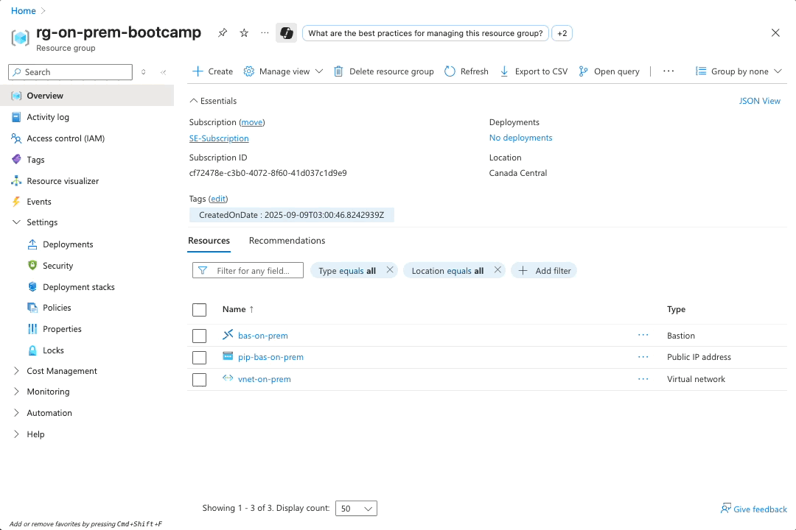

# Module 5 - Simulated On-Premises Environment

## Setting Up Your On-Premise Environment

Before proceeding, you need an on-premise environment to connect to your Azure cloud infrastructure. This simulates a traditional enterprise network connecting to Azure.

Choose one of the following options:

- **Option 1**: Build with Infrastructure as Code  
Use Terraform to automatically create your environment: [**Module 5a - On-prem environment with Terraform**](/modules/module-05a-on-prem-with-terraform/README.md)

- **Option 2**: Use Your Existing Environment  
If you already have a suitable environment, skip to: [**Module 6 - FortiGate HA Deployment: Deploy FortiGate Firewalls in Active-Passive HA with Load Balancers**](/modules/module-06-fortigate-ha-deployment/README.md)

- **Option 3**: Manual Setup  
Follow the step-by-step instructions in this module.

> [!NOTE]
> If you're participating in a guided bootcamp, wait for presenter instructions on which option to select.

## Creating the On-Premises Network Infrastructure

### Overview

In this module, we'll create a simulated on-premises environment that will later connect to our Azure hub-spoke topology via site-to-site VPN. This environment includes its own FortiGate firewall, Windows workstation, and proper network segmentation.


### Learning Objectives

By the end of this module, you will have:

- Created an on-premises network environment with proper segmentation
- Deployed a single FortiGate firewall for on-premises security
- Set up a Windows workstation for connectivity testing purposes
- Configured User-Defined Routes (UDRs) for traffic flow
- Established north-south internet connectivity through the FortiGate

---

## Part A: Create On-Premises Network Infrastructure

### Step 1: Create On-Premises Resource Group

#### 1.1 Create Resource Group

1. Navigate to **Resource groups**
2. Click **"+ Create"**
3. Configure:
   - **Subscription**: Your subscription
   - **Resource group name**: `rg-on-prem-bootcamp`
   - **Region**: `Canada Central`
4. Click **"Review + create"** then **"Create"**


---

### Step 2: Create On-Premises Virtual Network

#### 2.1 Create VNet with Bastion

1. Navigate to **`rg-on-prem-bootcamp`**
2. Click **"+ Create"** and search for: **`virtual network`**
3. **Basics** configuration:
   - **Resource group**: `rg-on-prem-bootcamp`
   - **Name**: `vnet-on-prem`
   - **Region**: `Canada Central`

   

4. Click **"Next : Security"**

#### 2.2 Configure Bastion

1. **Security** tab:
   - Check **"Enable Azure Bastion"**
   - **Bastion name**: `bas-on-prem`
   - Click **"Create a public IP address"**
   - **Public IP name**: `pip-bas-on-prem`
   - Click **"OK"**

   

2. Click **"Next : IP addresses"**

#### 2.3 Configure IP Addressing

1. **IP Addresses** tab:
   - **IPv4 address space**: `172.16.0.0/16`
   - **Edit default subnet**:
     - **Subnet name**: `protected`
     - **Subnet address range**: `172.16.4.0/24`
     - Click **"Save"**
   - **Bastion subnet**: `172.16.1.0/26` (automatically configured)

   

2. Click **"Review + create"** then **"Create"**

---

### Step 3: Create Windows Workstation

#### 3.1 Deploy Windows VM

1. In **`rg-on-prem-bootcamp`**, click **"+ Create"**
2. Search for: **`virtual machine`**
3. **Basics** configuration:
   - **Virtual machine name**: `vm-on-prem-windows`
   - **Region**: `Canada Central`
   - **Availability options**: `No infrastructure redundancy required`
   - **Image**: `Windows 11 Pro, Version 24H2 - x64 Gen2`
   - **Size**: `Standard_D2s_v3 (2 vcpus, 8 GiB memory)`

   

#### 3.2 Configure Authentication

1. **Username**: `azureuser`
2. **Password**: Create a strong password
3. **Public inbound ports**: `None`
4. Check **licensing confirmation** box
5. Click **"Next : Disks >"** (use the defaults)
6. Click **"Next : Networking >"**


#### 3.3 Configure Networking

1. **Networking** tab:
   - **Virtual network**: `vnet-on-prem`
   - **Subnet**: `protected (172.16.4.0/24)`
   - **Public IP**: `None`

   

2. Click **"Review + create"** then **"Create"**

#### 3.4 Test Bastion Connectivity

1. Once deployed, connect via **"Connect"** → **"Connect via Bastion"**
2. Use VM password authentication
   - **Username**: `azureuser`
   - **Password**: Password previously created
3. Verify you can access the Windows desktop


---

## Part B: Deploy On-Premises FortiGate

### Step 4: Create FortiGate Subnets

#### 4.1 Add Required Subnets

1. Navigate to **`rg-on-prem-bootcamp`** → **`vnet-on-prem`**
2. Under **Settings**, click **"Subnets"**
3. Create two additional subnets:

**External Subnet:**

- **Name**: `external`
- **Subnet address range**: `172.16.2.0/24`


**Internal Subnet:**

- **Name**: `internal`
- **Subnet address range**: `172.16.3.0/24`

#### 4.2 Verify Subnet Configuration

Your subnets should now include:

- `AzureBastionSubnet` (172.16.1.0/26)
- `external` (172.16.2.0/24)
- `internal` (172.16.3.0/24)
- `protected` (172.16.4.0/24)


---

### Step 5: Deploy FortiGate Single VM

#### 5.1 Start FortiGate Deployment

1. In **`rg-on-prem-bootcamp`**, click **"+ Create"**
2. Search for: **`FortiGate`**
3. Select **"Fortinet FortiGate Next-Generation Firewall"**
4. Click **"Create"** → **"Single VM"**


#### 5.2 Configure Basic Settings

1. **Basics** configuration:
   - **Resource group**: `rg-on-prem-bootcamp`
   - **Region**: `Canada Central`
   - **FortiGate VM instance Architecture**: `X64 - Intel / AMD based processors | Gen2 VM FortiGate 7.6+`
   - **Username**: `fortinetuser`
   - **Password**: Choose a strong password
   - **FortiGate Name Prefix**: `on-prem`

   

   - Click **Next**
   - **FortiGate Image SKU**: `Bring Your Own License or FortiFlex`
   - **FortiGate Image Version**: `7.6.4`
   - **Instance Type**: `Standard_D2 v4` (default for single VM)
   - **Availability Option**: `No infrastructure redundancy required`

   

#### 5.3 Configure Licensing

1. Check **"My organization is using the FortiFlex subscription service"**
2. **FortiFlex Token**: `[Token provided by instructor]`
3. Name of the FortiGate VM: `on-prem-fgt`

   

4. Click **"Next"**

#### 5.4 Configure Network Settings

1. **Virtual Network**: Select `vnet-on-prem`
2. **Subnet Mapping**:
   - **External Subnet**: `external`
   - **Internal Subnet**: `internal`
   - **Protected Subnet**: `protected`
3. **Accelerated Networking**: `Disabled`

   

4. Click **"Next"**

#### 5.5 Configure Public IP

1. **Public IP**: Click **"Create new"**
2. Configure:
   - **Name**: `pip-on-prem-fgt`
   - **SKU**: `Standard` (change from Basic)


#### 5.6 Deploy

1. Click **"Review + create"** then **"Create"**
2. Wait for deployment to complete (~10-15 minutes)

---

## Part C: Configure Traffic Routing and Firewall Rules

### Step 6: Create User-Defined Route (UDR)

#### 6.1 Create Route Table

1. In **`rg-on-prem-bootcamp`**, click **"+ Create"**
2. Search for: **`route table`**

   

3. Configure:
   - **Resource group**: `rg-on-prem-bootcamp`
   - **Region**: `Canada Central`
   - **Name**: `udr-on-prem`
   - **Propagate gateway routes**: `No`

   

4. Click **"Review + create"** then **"Create"**

#### 6.2 Find FortiGate Internal IP

1. Navigate to **`rg-on-prem-bootcamp`**
2. Find and click **`on-prem-fgt-n6.2ic2`** (internal NIC)
3. Note the **Private IP address** (should be `172.16.3.4`)

   

#### 6.3 Associate Route Table with Subnet

1. Click on route table **`udr-on-prem`**
2. Under **Settings**, click **"Subnets"**
3. Click **"+ Associate"**
4. Configure:
   - **Virtual network**: `vnet-on-prem`
   - **Subnet**: `protected`
5. Click **"OK"**


#### 6.4 Add Default Route

1. In **`udr-on-prem`**, under **Settings**, click **"Routes"**
2. Click **"+ Add"**
3. Configure:
   - **Route name**: `to_internet`
   - **Destination type**: `IP Addresses`
   - **Destination IP addresses/CIDR ranges**: `0.0.0.0/0`
   - **Next hop type**: `Virtual appliance`
   - **Next hop address**: `172.16.3.4`
4. Click **"Add"**


---

### Step 7: Configure FortiGate Firewall Rules

#### 7.1 Access FortiGate Web Interface

1. Navigate to **`rg-on-prem-bootcamp`**
2. Click on **`pip-on-prem-fgt`** public IP
3. Copy the **IP address**
4. Open new browser tab: `https://[FortiGate-Public-IP]`
5. Accept security certificate warnings
6. Login:
   - **Username**: `fortinetuser`
   - **Password**: The previous chosen password

#### 7.2 Configure System Settings

1. Navigate to **System** → **Settings**
2. Configure:
   - **Timezone**: Your timezone
   - **Idle timeout**: `60` minutes
3. Click **"Apply"**


#### 7.3 Create Internet Access Policy

1. Navigate to **Policy & Objects** → **Firewall Policy**
2. Click **"Create New"**
3. Configure:
   - **Name**: `internet_access`
   - **Action**: `ACCEPT`
   - **Incoming Interface**: `port2 (internal)`
   - **Outgoing Interface**: `port1 (external)`
   - **Source**: `all`
   - **Destination**: `all`
   - **Service**: `ALL`

   

4. Click **"OK"**

---

### Step 8: Test Connectivity

#### 8.1 Test Internet Access

1. Connect to **`vm-on-prem-windows`** via Bastion
2. Open Command Prompt
3. Test connectivity:

   ```cmd
   ping 8.8.8.8
   nslookup google.com
   ```

   

**Expected Result**: Both commands should work successfully, confirming internet access through FortiGate.

---

## Verification Checklist

Before proceeding to Module 6, verify you have completed:

**On-Premises Infrastructure:**

- [ ] Created `rg-on-prem-bootcamp` resource group
- [ ] Created `vnet-on-prem` with proper subnets
- [ ] Deployed `bas-on-prem` for secure access
- [ ] Created `vm-on-prem-windows` workstation

**FortiGate Configuration:**

- [ ] Created external and internal subnets
- [ ] Deployed FortiGate single VM (`on-prem-fgt`)
- [ ] Configured UDR to route traffic through FortiGate
- [ ] Created firewall policy for internet access
- [ ] Verified internet connectivity from Windows VM

---

## Architecture Review

After completing this module, your on-premises environment should look like this:


---

## Next Steps

Once you've completed this module and verified all connectivity, you're ready to proceed to [**Module 6 - FortiGate HA Deployment: Deploy FortiGate Firewalls in Active-Passive HA with Load Balancers**](/modules/module-06-fortigate-ha-deployment/README.md) (in the Azure hub-spoke environment).

This on-premises environment will later be connected to the Azure environment via site-to-site VPN tunnel.

**Estimated completion time**: 30-35 minutes
