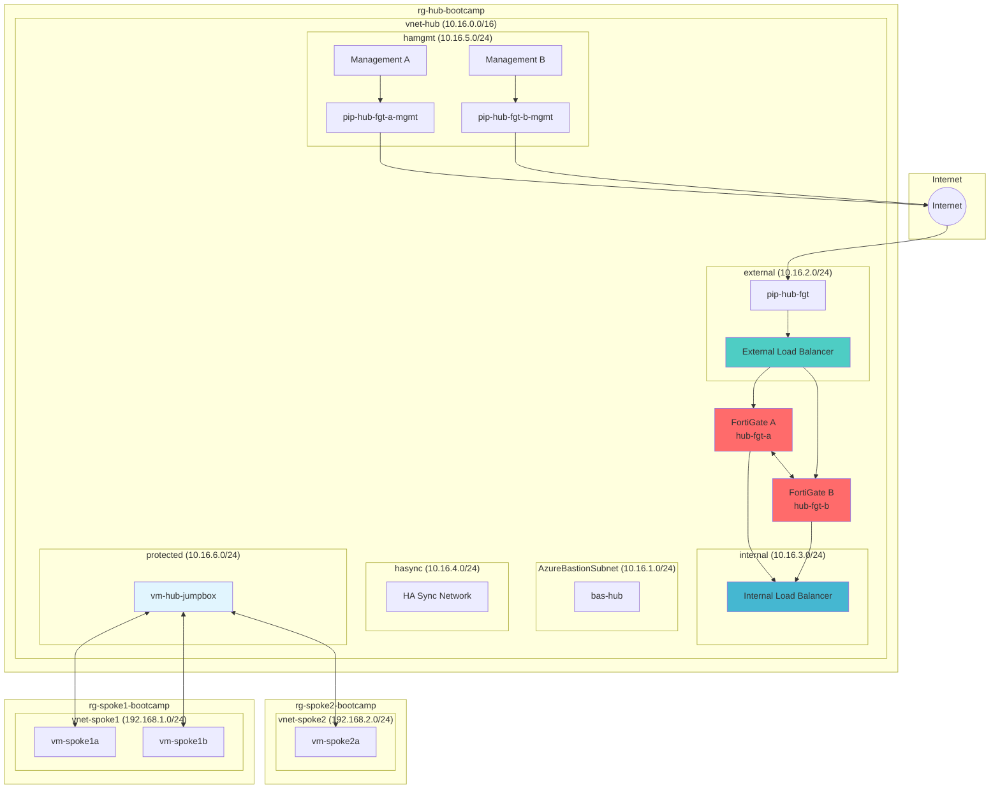

# Module 6 - FortiGate HA Deployment

## Deploy FortiGate Firewalls in Active-Passive HA with Load Balancers

### Overview
In this module, we'll deploy the core security infrastructure: FortiGate firewalls in Active-Passive High Availability mode with Azure Load Balancers. This will create the central security hub for our network topology.

### Learning Objectives
By the end of this module, you will have:
- Created the required subnets for FortiGate HA deployment
- Deployed FortiGate firewalls in Active-Passive HA configuration
- Configured external and internal load balancers
- Established the foundation for centralized security management

---

## Part A: Create Required Subnets

### Understanding FortiGate HA Subnet Requirements
FortiGate HA deployment requires **4 dedicated subnets** for proper operation:

| Subnet | Purpose | CIDR |
|--------|---------|------|
| **external** | Internet access via External Load Balancer | 10.16.2.0/24 |
| **internal** | Application gateway via Internal Load Balancer | 10.16.3.0/24 |
| **hasync** | High Availability synchronization between firewalls | 10.16.4.0/24 |
| **hamgmt** | Out-of-band management via public IP addresses | 10.16.5.0/24 |

---

### Step 1: Navigate to Hub VNet Subnets

#### 1.1 Access VNet Configuration
1. Navigate to **Resource groups** → **`rg-hub-bootcamp`**
2. Click on **`vnet-hub`**
3. Under **Settings**, click **"Subnets"**

#### 1.2 Current Subnet Status
You should see:
- `protected` (10.16.6.0/24) - Created in Module 2
- `AzureBastionSubnet` (10.16.1.0/24) - Created in Module 2

---

### Step 2: Create FortiGate Subnets

#### 2.1 Create External Subnet
1. Click **"+ Subnet"**
2. Configure:
   - **Name**: `external`
   - **Subnet address range**: `10.16.2.0/24`
   - Keep all other defaults
3. Click **"Save"**

#### 2.2 Create Internal Subnet
1. Click **"+ Subnet"**
2. Configure:
   - **Name**: `internal`
   - **Subnet address range**: `10.16.3.0/24`
3. Click **"Save"**

#### 2.3 Create HA Sync Subnet
1. Click **"+ Subnet"**
2. Configure:
   - **Name**: `hasync`
   - **Subnet address range**: `10.16.4.0/24`
3. Click **"Save"**

#### 2.4 Create HA Management Subnet
1. Click **"+ Subnet"**
2. Configure:
   - **Name**: `hamgmt`
   - **Subnet address range**: `10.16.5.0/24`
3. Click **"Save"**

#### 2.5 Verify Subnet Creation
Your subnet list should now show:
- `AzureBastionSubnet` (10.16.1.0/24)
- `external` (10.16.2.0/24)
- `internal` (10.16.3.0/24)
- `hasync` (10.16.4.0/24)
- `hamgmt` (10.16.5.0/24)
- `protected` (10.16.6.0/24)

---

## Part B: Deploy FortiGate HA Solution

### Step 3: Start FortiGate Deployment

#### 3.1 Navigate to Marketplace
1. In **`rg-hub-bootcamp`**, click **"+ Create"**
2. Search for: **`FortiGate`**
3. Select **"Fortinet FortiGate Next-Generation Firewall"**
4. Click **"Create"**

#### 3.2 Select Deployment Type
1. In the plan selection, click **"Active-Passive HA with ELB/ILB"**
2. Click **"Create"**

---

### Step 4: Configure Basic Settings

#### 4.1 Basic Configuration
1. **Basics** tab configuration:
   - **Subscription**: Your subscription
   - **Resource group**: `rg-hub-bootcamp`
   - **Region**: `Canada Central`
   - **Username**: `fortinetuser`
   - **Password**: `Chicken12345!`
   - **FortiGate Name Prefix**: `hub`
   - **FortiGate Image SKU**: `Bring Your Own License`
   - **FortiGate Image Version**: `7.4.5`
   - **Instance Type**: `Standard_F4s_v2` (default)

#### 4.2 Availability Configuration
1. **Availability Option**: Select **"Availability Zones"**
2. **Availability Zone 1**: `Zone 1`
3. **Availability Zone 2**: `Zone 2`

> [!NOTE]
> **Instance Requirements**: FortiGate HA requires minimum 4 NICs, which requires Standard_F4s_v2 (4 vCPUs). The F-series is optimized for network security workloads.

---

### Step 5: Configure Licensing

#### 5.1 FortiFlex Configuration
1. Check **"My organization is using the FortiFlex subscription service"**
2. **FortiFlex VM1 Token**: `[Token will be provided by instructor]`
3. **FortiFlex VM2 Token**: `[Token will be provided by instructor]`

> [!TIP]
> If you don't have FortiFlex tokens, you can proceed with PAYG (Pay-As-You-Go) licensing by unchecking this option.

---

### Step 6: Configure Network Settings

#### 6.1 Virtual Network Configuration
1. **Virtual Network**: Select `vnet-hub`
2. **Subnet Mapping**:
   - **External Subnet**: `external`
   - **Internal Subnet**: `internal`
   - **HA Sync Subnet**: `hasync`
   - **HA Management Subnet**: `hamgmt`
   - **Protected Subnet**: `protected`

#### 6.2 Accelerated Networking
1. **Accelerated Networking**: Select **"Disabled"**

> [!NOTE]
> In production, you would typically enable Accelerated Networking for better performance, but we're keeping it disabled for this lab to ensure compatibility.

---

### Step 7: Configure Public IP Addresses

#### 7.1 Create Public IP for External Load Balancer
1. **External Load Balancer Public IP**: Click **"Create new"**
2. Configure:
   - **Name**: `pip-hub-fgt`
   - **SKU**: `Standard` ⚠️ **Important: Change from Basic**
   - **Assignment**: `Static`
3. Click **"OK"**

#### 7.2 Create Public IP for FortiGate A Management
1. **FortiGate A Management Public IP**: Click **"Create new"**
2. Configure:
   - **Name**: `pip-hub-fgt-a-mgmt`
   - **SKU**: `Standard`
   - **Assignment**: `Static`
3. Click **"OK"**

#### 7.3 Create Public IP for FortiGate B Management
1. **FortiGate B Management Public IP**: Click **"Create new"**
2. Configure:
   - **Name**: `pip-hub-fgt-b-mgmt`
   - **SKU**: `Standard`
   - **Assignment**: `Static`
3. Click **"OK"**

---

### Step 8: Review and Deploy

#### 8.1 Final Review
1. Click **"Next"** through remaining tabs (keep defaults)
2. Click **"Review + create"**
3. Review all configurations
4. Click **"Create"**

> [!WARNING]
> **Deployment Time**: FortiGate HA deployment typically takes 15-20 minutes. This includes creating VMs, load balancers, and configuring HA synchronization.

---

## Understanding the Deployment

### What Gets Created:
- **2 FortiGate VMs**: Active-Passive HA pair
- **External Load Balancer**: Routes inbound traffic from internet
- **Internal Load Balancer**: Routes traffic from internal networks
- **3 Public IP Addresses**: For external access and management
- **Network Security Groups**: Basic security rules
- **HA Configuration**: Automatic failover between firewalls

### Network Interfaces per FortiGate:
Each FortiGate VM gets **4 NICs**:
1. **External NIC**: Connected to external subnet (internet-facing)
2. **Internal NIC**: Connected to internal subnet (application-facing)
3. **HA Sync NIC**: Connected to hasync subnet (HA communication)
4. **Management NIC**: Connected to hamgmt subnet (out-of-band management)

---

## Verification Checklist

Once deployment completes, verify you have created:

**Subnets:**
- [ ] `external` subnet (10.16.2.0/24)
- [ ] `internal` subnet (10.16.3.0/24)
- [ ] `hasync` subnet (10.16.4.0/24)
- [ ] `hamgmt` subnet (10.16.5.0/24)

**FortiGate Resources:**
- [ ] 2 FortiGate VMs (hub-fgt-a, hub-fgt-b)
- [ ] External Load Balancer with `pip-hub-fgt`
- [ ] Internal Load Balancer
- [ ] Management public IPs for both FortiGates

---

## Architecture Review

After completing this module, your infrastructure should look like this:

---

## Next Steps

Once deployment completes successfully, you're ready to proceed to **Module 6: User-Defined Routes (UDRs)**.

In Module 6, we'll configure routing to direct all traffic through the FortiGate firewalls for security inspection.

**Estimated completion time**: 25-30 minutes (including deployment wait time)

> [!TIP]
> While waiting for deployment, this is a good time to take a break or review the FortiGate documentation!