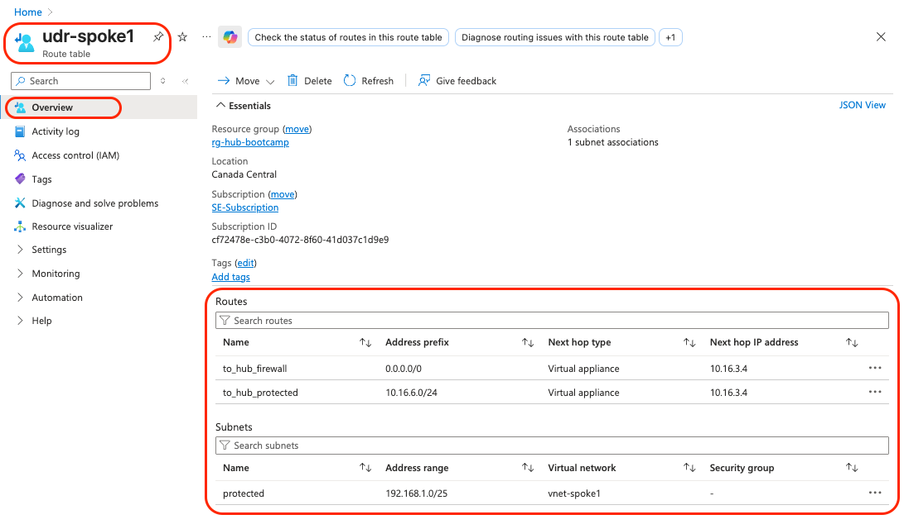

# Module 7 - User-Defined Routes (UDRs)

## Configuring Traffic Flow Through FortiGate Firewalls

### Overview
In this module, we'll configure User-Defined Routes (UDRs) to direct all traffic from the spoke networks through the FortiGate firewalls in the hub. This establishes centralized security control and ensures all inter-network communication is inspected by the FortiGate cluster.

### Learning Objectives
By the end of this module, you will have:
- Created route tables for both spoke networks and the hub protected subnet
- Configured routes pointing to the FortiGate internal load balancer
- Established centralized traffic flow through the security hub
- Prepared the network for end-to-end connectivity testing

## Understanding UDRs and Traffic Flow

### Why UDRs Are Needed
By default, Azure uses system routes for communication between peered VNets. To insert the FortiGate firewalls into the traffic path for security inspection, we must override these system routes with custom routes that direct traffic through the FortiGate internal load balancer.

### Traffic Flow Architecture
```
Spoke VMs → UDR → Internal Load Balancer (10.16.3.4) → FortiGate Cluster → Destination
```

---

## Step 1: Find Internal Load Balancer IP Address

### 1.1 Locate Internal Load Balancer
1. Navigate to **`rg-hub-bootcamp`** resource group
2. Find and click on **`hub-internalloadbalancer`**
3. In the **Settings > Frontend IP configuration** section, note the **IP address**

**Expected IP**: `10.16.3.4`


> [!NOTE]
> This IP address is the next-hop for all traffic that needs to be routed through the FortiGate firewalls.

---

## Step 2: Create and Configure Spoke1 UDR

### 2.1 Create Spoke1 Route Table
1. Navigate to **`rg-spoke1-bootcamp`** resource group
2. Click **"+ Create"**
3. Search for: **`route table`**
4. Click **"Create"**


### 2.2 Configure Spoke1 Route Table
1. **Basics** configuration:
   - **Subscription**: Your subscription
   - **Resource group**: `rg-spoke1-bootcamp`
   - **Region**: `Canada Central`
   - **Name**: `udr-spoke1`
   - **Propagate gateway routes**: `No`


2. Click **"Review + create"** then **"Create"**

### 2.3 Associate Route Table with Spoke1 Subnet
1. Navigate to **`rg-spoke1-bootcamp`** → **`udr-spoke1`**
2. Under **Settings**, click **"Subnets"**
3. Click **"+ Associate"**
4. Configure:
   - **Virtual network**: `vnet-spoke1`
   - **Subnet**: `protected`
5. Click **"OK"**


### 2.4 Add Default Route for Spoke1
1. In **`udr-spoke1`**, under **Settings**, click **"Routes"**
2. Click **"+ Add"**
3. Configure the route:
   - **Route name**: `to_hub_firewall`
   - **Destination type**: `IP Addresses`
   - **Destination IP addresses/CIDR ranges**: `0.0.0.0/0`
   - **Next hop type**: `Virtual appliance`
   - **Next hop address**: `10.16.3.4`
4. Click **"Add"**


---

> [!NOTE]
> The Steps 3 and 4 are similar to Step 2. For this reason, we are not including the screenshots for the following 2 Steps. Please refer to Step 2 in case of doubt. 

## Step 3: Create and Configure Spoke2 UDR

### 3.1 Create Spoke2 Route Table
1. Navigate to **`rg-spoke2-bootcamp`** resource group
2. Click **"+ Create"**
3. Search for: **`route table`**
4. Click **"Create"**

### 3.2 Configure Spoke2 Route Table
1. **Basics** configuration:
   - **Subscription**: Your subscription
   - **Resource group**: `rg-spoke2-bootcamp`
   - **Region**: `Canada Central`
   - **Name**: `udr-spoke2`
   - **Propagate gateway routes**: `No`

2. Click **"Review + create"** then **"Create"**

### 3.3 Associate Route Table with Spoke2 Subnet
1. Navigate to **`rg-spoke2-bootcamp`** → **`udr-spoke2`**
2. Under **Settings**, click **"Subnets"**
3. Click **"+ Associate"**
4. Configure:
   - **Virtual network**: `vnet-spoke2`
   - **Subnet**: `protected`
5. Click **"OK"**

### 3.4 Add Default Route for Spoke2
1. In **`udr-spoke2`**, under **Settings**, click **"Routes"**
2. Click **"+ Add"**
3. Configure the route:
   - **Route name**: `to_hub_firewall`
   - **Destination type**: `IP Addresses`
   - **Destination IP addresses/CIDR ranges**: `0.0.0.0/0`
   - **Next hop type**: `Virtual appliance`
   - **Next hop address**: `10.16.3.4`
4. Click **"Add"**


---

## Step 4: Create and Configure Hub Protected Subnet UDR

### 4.1 Create Hub Route Table
1. Navigate to **`rg-hub-bootcamp`** resource group
2. Click **"+ Create"**
3. Search for: **`route table`**
4. Click **"Create"**

### 4.2 Configure Hub Route Table
1. **Basics** configuration:
   - **Subscription**: Your subscription
   - **Resource group**: `rg-hub-bootcamp`
   - **Region**: `Canada Central`
   - **Name**: `udr-hub-protected`
   - **Propagate gateway routes**: `No`

2. Click **"Review + create"** then **"Create"**

### 4.3 Associate Route Table with Hub Protected Subnet
1. Navigate to **`rg-hub-bootcamp`** → **`udr-hub-protected`**
2. Under **Settings**, click **"Subnets"**
3. Click **"+ Associate"**
4. Configure:
   - **Virtual network**: `vnet-hub`
   - **Subnet**: `protected`
5. Click **"OK"**

### 4.4 Add Routes for Hub Protected Subnet

#### Route 1: Spoke1 Traffic
1. In **`udr-hub-protected`**, under **Settings**, click **"Routes"**
2. Click **"+ Add"**
3. Configure:
   - **Route name**: `to_spoke1`
   - **Destination type**: `IP Addresses`
   - **Destination IP addresses/CIDR ranges**: `192.168.1.0/24`
   - **Next hop type**: `Virtual appliance`
   - **Next hop address**: `10.16.3.4`
4. Click **"Add"**

#### Route 2: Spoke2 Traffic
1. Click **"+ Add"**
2. Configure:
   - **Route name**: `to_spoke2`
   - **Destination type**: `IP Addresses`
   - **Destination IP addresses/CIDR ranges**: `192.168.2.0/24`
   - **Next hop type**: `Virtual appliance`
   - **Next hop address**: `10.16.3.4`
3. Click **"Add"**

#### Route 3: Internet Traffic
1. Click **"+ Add"**
2. Configure:
   - **Route name**: `to_internet`
   - **Destination type**: `IP Addresses`
   - **Destination IP addresses/CIDR ranges**: `0.0.0.0/0`
   - **Next hop type**: `Virtual appliance`
   - **Next hop address**: `10.16.3.4`
3. Click **"Add"**


> [!NOTE]
> **Why Multiple Routes for Hub**: The hub needs specific routes for spoke networks and a default route for internet traffic to ensure all communication is inspected by FortiGate, while spokes can use a single default route since all their traffic should go through the firewall.

---

## Step 5: Verify UDR Configuration

### 5.1 Check Spoke1 Configuration
1. Navigate to **`udr-spoke1`**
2. Verify:
   - **Associated subnet**: `vnet-spoke1/protected`
   - **Route**: `to_hub_firewall` pointing to `10.16.3.4`



### 5.2 Check Spoke2 Configuration
1. Navigate to **`udr-spoke2`**
2. Verify:
   - **Associated subnet**: `vnet-spoke2/protected`
   - **Route**: `to_hub_firewall` pointing to `10.16.3.4`


### 5.3 Check Hub Protected Configuration
1. Navigate to **`udr-hub-protected`**
2. Verify:
   - **Associated subnet**: `vnet-hub/protected`
   - **Routes**:
     - `to_spoke1` pointing to `10.16.3.4`
     - `to_spoke2` pointing to `10.16.3.4`
     - `to_internet` pointing to `10.16.3.4`


---

## Understanding the Traffic Impact

### Current Traffic Flow
After implementing UDRs, all traffic will follow this path:

**For Internet-bound traffic:**
```
Spoke VM → UDR (0.0.0.0/0) → Internal LB (10.16.3.4) → FortiGate → External LB → Internet
```

**For Inter-spoke traffic:**
```
Spoke1 VM → UDR → Internal LB → FortiGate → Internal LB → Hub → Spoke2 VM
```

**For Hub-to-spoke traffic:**
```
Hub VM → UDR → Internal LB → FortiGate → Internal LB → Spoke VM
```

> [!WARNING]
> **Connectivity Impact**: After implementing UDRs, all VMs will lose internet connectivity and inter-network connectivity until FortiGate firewall policies are configured in the next module.

---

## Verification Checklist

Before proceeding to Module 8, verify you have completed:

**Route Tables Created:**
- [ ] Created `udr-spoke1` in `rg-spoke1-bootcamp`
- [ ] Created `udr-spoke2` in `rg-spoke2-bootcamp`
- [ ] Created `udr-hub-protected` in `rg-hub-bootcamp`

**Subnet Associations:**
- [ ] Associated `udr-spoke1` with `vnet-spoke1/protected`
- [ ] Associated `udr-spoke2` with `vnet-spoke2/protected`
- [ ] Associated `udr-hub-protected` with `vnet-hub/protected`

**Routes Configured:**
- [ ] Added default route (0.0.0.0/0) in `udr-spoke1` pointing to 10.16.3.4
- [ ] Added default route (0.0.0.0/0) in `udr-spoke2` pointing to 10.16.3.4
- [ ] Added spoke1 route (192.168.1.0/24) in `udr-hub-protected` pointing to 10.16.3.4
- [ ] Added spoke2 route (192.168.2.0/24) in `udr-hub-protected` pointing to 10.16.3.4
- [ ] Added internet route (0.0.0.0/0) in `udr-hub-protected` pointing to 10.16.3.4

**Internal Load Balancer:**
- [ ] Confirmed Internal LB IP address is 10.16.3.4

---

## Architecture Review

After completing this module, your traffic flow should look like this:


**Legend:**
- **All traffic** now flows through UDRs to FortiGate cluster
- **Hub VM** also routes through FortiGate for complete security inspection
- **Orange boxes**: UDR routing decisions covering all network segments

---

## Next Steps

Once you've completed this module and verified the UDR configuration, you're ready to proceed to [**Module 8 - FortiGate Configuration and Traffic Testing: Testing and Configuring FortiGate Security Policies**](/modules/module-08-fortigate-config-test/README.md).

In Module 8, we'll configure the FortiGate firewalls to allow traffic flow and test end-to-end connectivity.

**Estimated completion time**: 15-20 minutes

> [!NOTE]
> **Expected Behavior**: After this module, all VMs will temporarily lose connectivity until FortiGate policies are configured. This is normal and expected behavior.