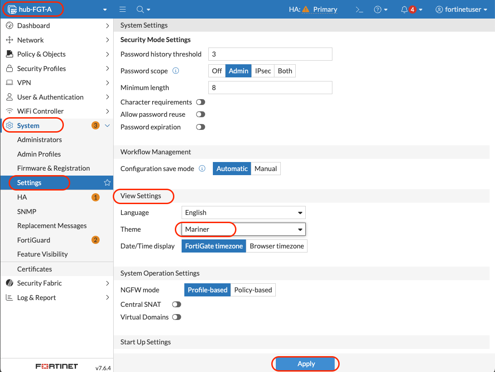
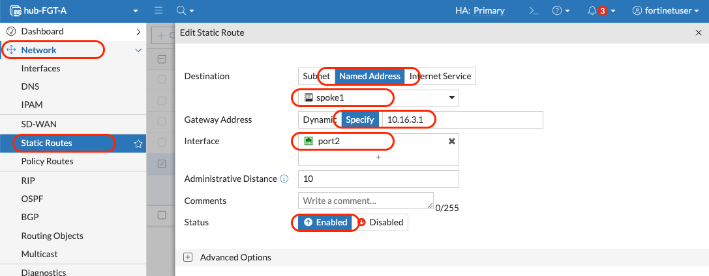
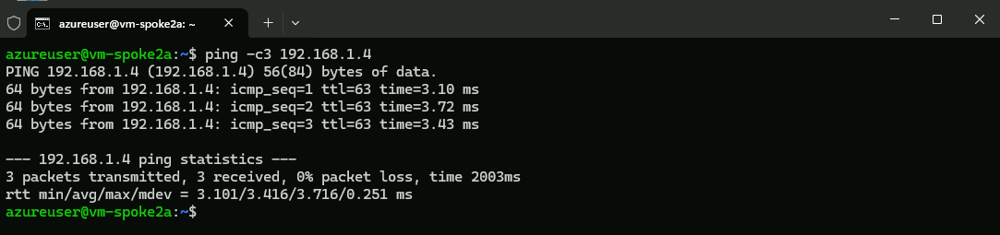

# Module 8 - FortiGate Configuration and Traffic Testing

## Testing and Configuring FortiGate Security Policies

### Overview
Now that our UDRs are configured to route all traffic through the FortiGate cluster, we need to configure the FortiGate firewall policies to allow legitimate traffic while maintaining security. This module covers initial testing, policy creation, and advanced traffic flow scenarios.

### Learning Objectives
By the end of this module, you will have:
- Accessed and configured the FortiGate web interface
- Created firewall policies for north-south (internet) traffic
- Configured east-west traffic inspection between spokes
- Implemented micro-segmentation within subnets
- Validated complete traffic flow through the security fabric

---

## Part A: Initial Environment Testing

### Step 1: Explore the Deployed Resources

#### 1.1 Review Resource Dependencies
1. Navigate to **`rg-hub-bootcamp`** resource group
2. Click **"Resource Visualizer"** in the left menu
3. Observe the relationships between FortiGate VMs, load balancers, and network components


#### 1.2 Identify Active FortiGate
1. In **`rg-hub-bootcamp`**, find **`pip-hub-fgt-a-mgmt`**
2. Click on the public IP resource
3. Copy the **IP address** (this is FortiGate A's management interface)


---

### Step 2: Configure FortiGate Basic Settings

#### 2.1 Access FortiGate Web Interface
1. Open a new browser tab: `https://[FortiGate-A-Public-IP]`
2. Accept security certificate warnings
3. Login credentials:
   - **Username**: `fortinetuser`
   - **Password**: Use the previously chosen password

#### 2.2 Configure System Settings
1. Navigate to **System** → **Settings**
2. Configure:
   - **Timezone**: Select your timezone
   - **Idle timeout**: `60` minutes

   

   - **View Setting > Theme**: `Mariner` (so we can visually differentiate the on-prem FortiGate (Jade - green) from the Azure FortiGate (Mariner - blue))

   

3. Click **"Apply"**

#### 2.3 Explore FortiGate Interface Configuration
1. Navigate to **Network** → **Interfaces**
2. Note the port assignments:
   - **port1** → external subnet (internet-facing)
   - **port2** → internal subnet (application-facing)
   - **port3** → HASync subnet (HA synchronization)
   - **port4** → HAMgmt subnet (management)

   

#### 2.4 Review Initial Routing
1. Navigate to **Network** → **Static Routes**
2. Observe the pre-configured routes for basic connectivity

   

3. Alternative view: **Dashboard** → **Network** → **"Static & Dynamic Routing"**

   

#### 2.5 Check Security Policies
1. Navigate to **Policy & Objects** → **Firewall Policy**
2. **Note**: Only implicit deny rules exist (all traffic blocked by default)

   

---

### Step 3: Create Connectivity for the vm-jumpbox-hub

#### 3.1 Create Address Objects for Hub and Spokes
1. Navigate to **Policy & Objects** → **Addresses**
2. Click **"Create New"**

**Create Hub Address Object:**
- **Name**: `hub`
- **Interface**: `port2`
- **Type**: `Subnet`
- **Subnet**: `10.16.6.0/24`
- **Static Route Configuration**: `Enable`
- Click **"OK"**


**Create Spoke1 Address Object:**
- **Name**: `spoke1`
- **Interface**: `port2`
- **Type**: `Subnet`
- **Subnet**: `192.168.1.0/24`
- **Static Route Configuration**: `Enable`
- Click **"OK"**

**Create Spoke2 Address Object:**
- **Name**: `spoke2`
- **Interface**: `port2`
- **Type**: `Subnet`
- **Subnet**: `192.168.2.0/24`
- **Static Route Configuration**: `Enable`
- Click **"OK"**

#### 3.2 Create Static Routes for Spokes
1. Navigate to **Network** → **Static Routes**
2. Click **"Create New"**

**Route to Spoke1:**
- **Destination**: Select `Named Address` → `spoke1`
- **Gateway Address**: `10.16.3.1` (internal subnet gateway)
- **Interface**: `port2`
- Click **"OK"**



**Route to Spoke2:**
- **Destination**: Select `Named Address` → `spoke2`
- **Gateway Address**: `10.16.3.1` (internal subnet gateway)
- **Interface**: `port2`
- Click **"OK"**

#### 3.3 Create a Firewal Policy to allow connections from vm-jumpbox-hub 
1. Create a Firewall Policy to allow traffic between the protected subnet in the vnet-hub virtual network to the hosts in the spokes.
2. In FortiGate, navigate to **Policy & Objects** → **Firewall Policy**
3. Click **"Create New"**
4. Configure policy:
   - **Name**: `hub_to_spokes`
   - **Action**: `ACCEPT`
   - **Incoming Interface**: `port2` (internal)
   - **Outgoing Interface**: `port2` (external)
   - **Source**: `hub`
   - **Destination**: `spoke1`, `spoke2`
   - **Service**: `ALL`
   - **NAT**: `Disable` (default)

   

5. Click **"OK"**
---

### Step 4: Initial Connectivity Testing

#### 4.1 Test Spoke VMs Internet Access
Connect to spoke VMs via hub jumpbox and test:

**From vm-hub-jumpbox:**
1. Open the `Command Prompt`

   ```bash
   ssh azureuser@192.168.1.4
   ```

   

2. From the `vm-spoke1a` test:

   ```bash
   curl -v -sI -m3 https://www.google.com
   ```
   
   

   **Expected Result**: Connection fails (blocked by implicit deny)

3. Disconnect from the vm-spoke1a 

   ```bash
   exit
   ``` 

**From vm-spoke2a:**
1. in the `Command Prompt`

   ```bash
   ssh azureuser@192.168.2.4
   ```

2. From the `vm-spoke2a` test:

   ```bash
   curl -v -sI -m3 https://www.google.com
   ```

   **Expected Result**: Connection fails (blocked by implicit deny)

3. Disconnect from the vm-spoke2a 

   ```bash
   exit
   ```

#### 4.2 Test Intra-Spoke Connectivity

**From vm-spoke1a to vm-spoke1b:**

```bash
ping 192.168.1.5
```

**Expected Result**: Works (traffic stays within same VNet, bypasses FortiGate)


#### 4.3 Test Inter-Spoke Connectivity
**From vm-spoke1a to vm-spoke2a:**
```bash
ping 192.168.2.4
```
**Expected Result**: Fails (no routes configured, blocked by implicit deny)

---

## Part B: Configure North-South Traffic (Internet Access)

### Step 5: Create Internet Access Policy

#### 5.1 Create Internet Access Rule
1. In FortiGate, navigate to **Policy & Objects** → **Firewall Policy**
2. Click **"Create New"**
3. Configure policy:
   - **Name**: `internet_access`
   - **Action**: `ACCEPT`  
   - **Incoming Interface**: `port2` (internal)
   - **Outgoing Interface**: `port1` (external)
   - **Source**: `all`
   - **Destination**: `all`
   - **Service**: `ALL`
   - **NAT**: `Enable` (default)  

   

4. Click **"OK"**

#### 5.2 Test North-South Connectivity

**From vm-spoke1a:**
```bash
curl -sI -m3 https://www.google.com
```
**Expected Result**: Now works (traffic flows through FortiGate)


**From vm-spoke2a:**
```bash
curl -sI -m3 https://www.google.com
```
**Expected Result**: Now works (traffic flows through FortiGate)


---

## Part C: Configure East-West Traffic (Inter-Spoke)

### Step 6: Create Inter-Spoke Policies

#### 6.1 Create Spoke1-to-Spoke2 Policy
1. Navigate to **Policy & Objects** → **Firewall Policy**
2. Click **"Create New"**
3. Configure:
   - **Name**: `spoke1_to_spoke2`
   - **Action**: `ACCEPT`   
   - **Incoming Interface**: `port2`
   - **Outgoing Interface**: `port2`
   - **Source**: `spoke1`
   - **Destination**: `spoke2`
   - **Service**: `ALL`
   - **NAT**: `Disable` ⚠️ **Important: Turn off NAT**  

   

4. Click **"OK"**

#### 6.2 Create Spoke2-to-Spoke1 Policy (Initially Deny)
1. Click **"Create New"**
2. Configure:
   - **Name**: `spoke2_to_spoke1`
   - **Action**: `DENY`  
   - **Incoming Interface**: `port2`
   - **Outgoing Interface**: `port2`
   - **Source**: `spoke2`
   - **Destination**: `spoke1`
   - **Service**: `ALL`

   

4. Click **"OK"**

#### 6.3 Add Inter-Spoke Routes in Azure

**Add Spoke2 Route to Spoke1 UDR:**
1. Navigate to **`rg-spoke1-bootcamp`** → **`udr-spoke1`**
2. Under **Settings**, click **"Routes"**
3. Click **"+ Add"**
4. Configure:
   - **Route name**: `to_spoke2`
   - **Destination type**: `IP Addresses`
   - **Destination IP addresses/CIDR ranges**: `192.168.2.0/24`
   - **Next hop type**: `Virtual appliance`
   - **Next hop address**: `10.16.3.4`
5. Click **"Add"**


**Add Spoke1 Route to Spoke2 UDR:**
1. Navigate to **`rg-spoke2-bootcamp`** → **`udr-spoke2`**
2. Under **Settings**, click **"Routes"**
3. Click **"+ Add"**
4. Configure:
   - **Route name**: `to_spoke1`
   - **Destination type**: `IP Addresses`
   - **Destination IP addresses/CIDR ranges**: `192.168.1.0/24`
   - **Next hop type**: `Virtual appliance`
   - **Next hop address**: `10.16.3.4`
5. Click **"Add"**


#### 6.4 Test Directional Traffic Flow
**From vm-spoke1a to vm-spoke2a:**
```bash
ping -c3 192.168.2.4
```
**Expected Result**: Works (allowed by spoke1_to_spoke2 policy)


**From vm-spoke2a to vm-spoke1a:**
```bash
ping -c3 192.168.1.4
```
**Expected Result**: Fails (blocked by spoke2_to_spoke1 deny policy)


#### 6.5 Enable Bidirectional Communication
1. In FortiGate, navigate to **Policy & Objects** → **Firewall Policy**
2. Edit the **`spoke2_to_spoke1`** policy
3. Change **Action** from `DENY` to `ACCEPT`
4. Make sure that the NAT is `Disable`
4. Click **"OK"**


**Test again from vm-spoke2a:**
```bash
ping -c3 192.168.1.4
```
**Expected Result**: Now works



---

## Part D: Implement Micro-Segmentation

### Step 7: Configure Intra-Spoke Inspection

#### 7.1 Add Intra-Spoke Route
1. Navigate to **`rg-spoke1-bootcamp`** → **`udr-spoke1`**
2. Click **"+ Add"** under Routes
3. Configure:
   - **Route name**: `to_spoke1_internal`
   - **Destination type**: `IP Addresses`
   - **Destination IP addresses/CIDR ranges**: `192.168.1.0/24`
   - **Next hop type**: `Virtual appliance`
   - **Next hop address**: `10.16.3.4`
4. Click **"Add"**


#### 7.2 Create Micro-Segmentation Policy
1. In FortiGate, navigate to **Policy & Objects** → **Firewall Policy**
2. Click **"Create New"**
3. Configure:
   - **Name**: `spoke1_internal_deny`
   - **Action**: `DENY`
   - **Incoming Interface**: `port2`
   - **Outgoing Interface**: `port2`
   - **Source**: `spoke1`
   - **Destination**: `spoke1`
   - **Service**: `ALL`

4. Click **"OK"**


#### 7.3 Test Micro-Segmentation
**From vm-spoke1a to vm-spoke1b:**
```bash
ping -c3 192.168.1.5
```
**Expected Result**: Fails (now inspected and blocked by FortiGate)


> [!NOTE]
> **Micro-Segmentation**: By forcing intra-subnet traffic through the FortiGate, we can implement granular security policies even within the same network segment.

---

## Verification Checklist

Before proceeding to the next module, verify you have completed:

**FortiGate Configuration:**
- [ ] Accessed FortiGate web interface successfully
- [ ] Configured timezone and timeout settings
- [ ] Created address objects for hub, spoke1 and spoke2
- [ ] Added static routes for hub and spoke networks

**Security Policies:**
- [ ] Created hub_to_spoke policy (east-west traffic)
- [ ] Created internet_access policy (north-south traffic)
- [ ] Created spoke1_to_spoke2 policy (east-west traffic)
- [ ] Created spoke2_to_spoke1 policy (bidirectional east-west)
- [ ] Created micro-segmentation policy (intra-spoke inspection)

**Azure Routes:**
- [ ] Added inter-spoke routes in both UDRs
- [ ] Added intra-spoke route for micro-segmentation

**Connectivity Testing:**
- [ ] Verified internet access from both spokes
- [ ] Tested directional inter-spoke communication
- [ ] Validated micro-segmentation functionality

---

## Architecture Review

After completing this module, your traffic flows should work as follows:


---

## Next Steps

Once you've completed this module and verified all traffic flows, you're ready to proceed to [**Module 9 - Site-to-Site IPSec VPN: Connecting On-Premises and Azure Environments**](/modules/module-09-site-to-site-vpn/README.md).  

In Module 9, we'll deploy the centralized logging and management components of the Fortinet Security Fabric.

**Estimated completion time**: 40-45 minutes