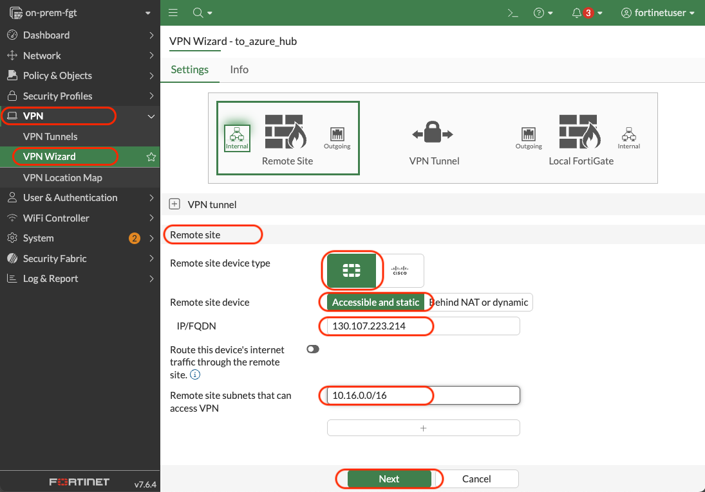
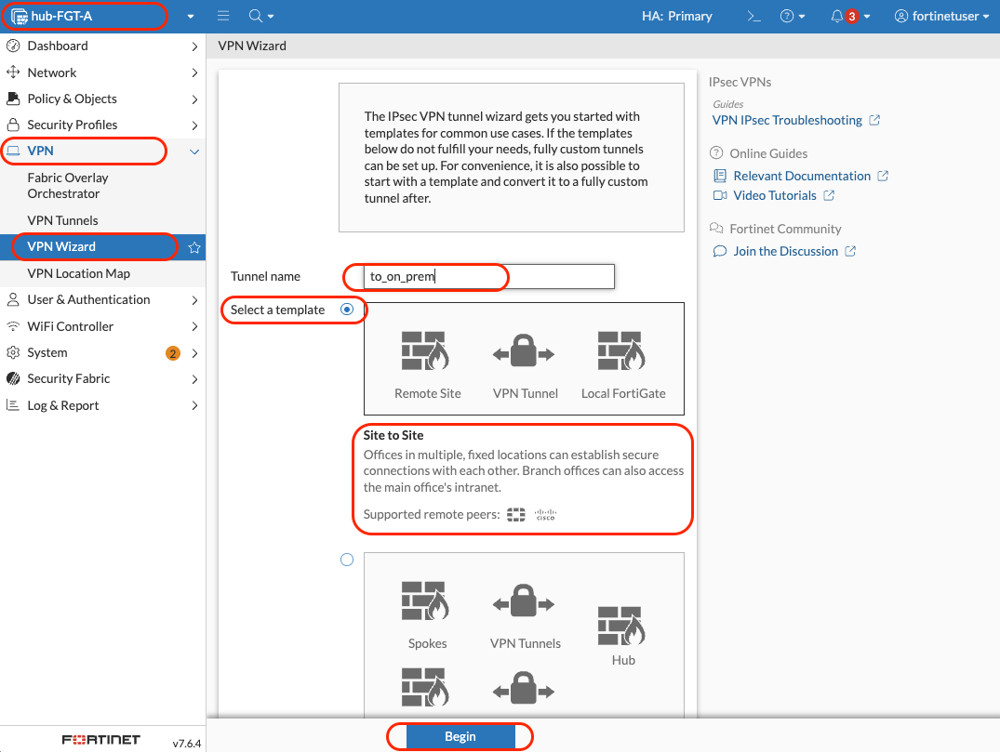
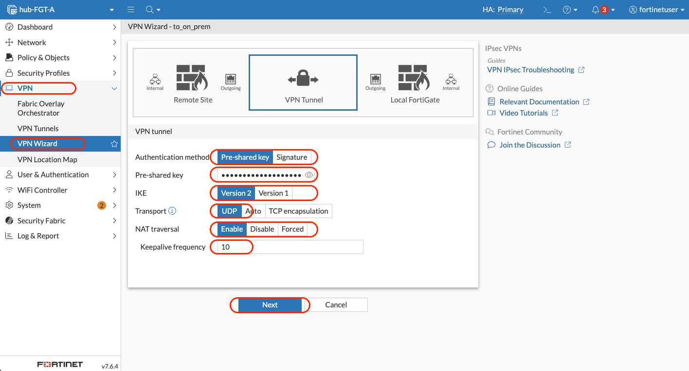
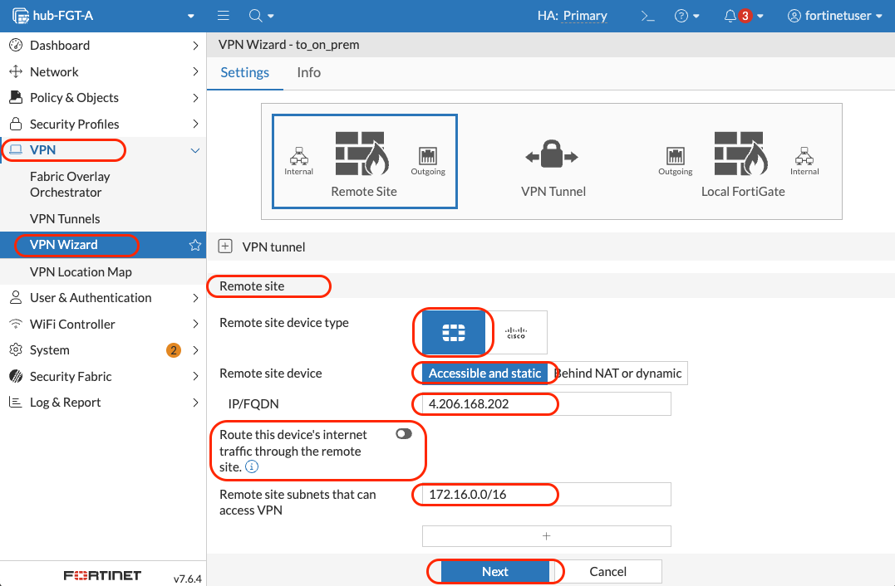
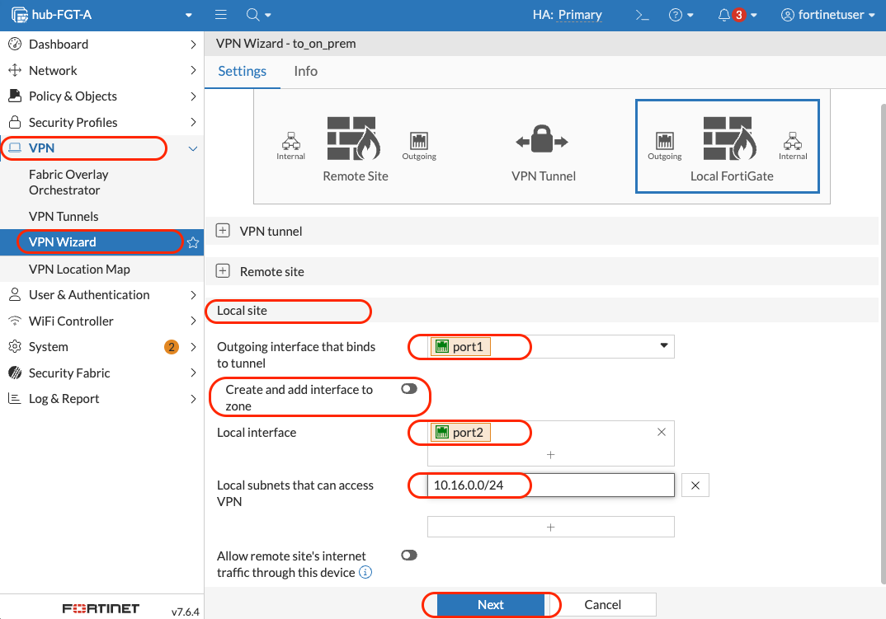

# Module 9 - Site-to-Site IPSec VPN

## Connecting On-Premises and Azure Environments

### Overview
In this module, we'll establish a secure site-to-site IPSec VPN tunnel between the on-premises FortiGate and the Azure FortiGate cluster. This creates a hybrid connectivity solution that allows secure communication between on-premises and cloud resources.

### Learning Objectives
By the end of this module, you will have:
- Configured IPSec VPN on both FortiGate environments
- Established secure communication between on-premises and Azure networks
- Created firewall policies for cross-site connectivity
- Tested traffic flow through the VPN tunnel
- Validated hybrid network connectivity

---

## Understanding the VPN Architecture

### Network Overview


### VPN Parameters
| Parameter | On-Premises | Azure Hub |
|-----------|-------------|-----------|
| **Local Subnets** | 172.16.4.0/24 | 192.168.1.0/24, 192.168.2.0/24 |
| **Public IP** | pip-on-prem-fgt | pip-hub-fgt |
| **Interface** | port1 (external) | port1 (external) |
| **Internal Interface** | port2 (internal) | port2 (internal) |

---

## Part A: Configure On-Premises FortiGate VPN

### Step 1: Access On-Premises FortiGate

#### 1.1 Get Public IP Address - If you followed Module 05
1. Navigate to **`rg-on-prem-bootcamp`**  
2. Click on **`pip-on-prem-fgt`**
3. Copy the **IP address**


#### 1.2 Log into FortiGate
1. Open browser: `https://[on-prem-public-ip]`
2. Login credentials:
   - **Username**: `fortinetuser`
   - **Password**: Use the password you created before

#### 1.3 Change the HTTPS port for adminstrative access
When creating a VPN on FortiGate, you'll encounter a port conflict that requires changing the administrative access port. Here's how to explain this:

**The Port Conflict Issue**

By default, FortiGate uses port 443 for HTTPS administrative access. However, when you configure an IPsec VPN, the IKE (Internet Key Exchange) protocol also needs to use port 443 for TCP connections in certain scenarios (like when traversing NAT devices or firewalls that block UDP 500/4500).

**Why You Must Change the Admin Port**
Since both services cannot share the same port on the same interface, you have two options:

- Change the administrative HTTPS port to something else (recommended)
- Use a different port for IKE TCP (less common)

For this bootcamp, let's change the port for administrative access in the FortiGate.

1. Navigate to System Settings

   - **Go to System > Settings**
   - **HTTPS port**: `8443`

2. Click on **`Apply`**

   

   The system will prompt you that the change requires reconnection

3. Reconnect to FortiGate

   Your current session will be disconnected
   Reconnect using the new URL: https://pip-on-prem-fgt:new-port


---

### Step 2: Get Azure FortiGate Public IP

#### 2.1 Find Azure FortiGate Public IP
1. Navigate to **`rg-hub-bootcamp`**
2. Click on **`pip-hub-fgt`** (External Load Balancer Public IP)
3. Copy the **IP address** (this will be the remote gateway)


> [!NOTE]
> We use the External Load Balancer IP because it's the public-facing IP for the Azure FortiGate cluster.

---

### Step 3: Create VPN on On-Premises FortiGate

#### 3.1 Start VPN Wizard
1. In on-premises FortiGate, navigate to **VPN** → **VPN Wizard**
2. Configure VPN Setup:
   - **Tunnel name**: `to_azure_hub`
   - **Template**: `Site to Site`
3. Click **"Begin"**


#### 3.2 Configure VPN Tunnel
1. **VPN Tunnel** settings:
   - **Authentication Method**: `Pre-shared Key`
   - **Pre-shared Key**: `FortinetBootcamp2025!`
   - **IKE**: `Version 2`
   - **Transport**: `Auto`
   - **Use Fortinet encapsulation**: `Disabled`
   - **NAT traversal**: `Enable`
   - **Keepalive frequency**: `10`
2. Click **"Next"**


#### 3.3 Configure Remote Site
1. **Remote Site** configuration:
   - **Remote site device type**: `FortiGate` (Logo)
   - **Remote site device**: `Accessible and static`
   - **IP address**: `[Azure-FortiGate-Public-IP]` (from Step 2.1)
   - **Route this device's internet traffic through the remote site.**: `Disable`
   - **Remote site subnets**: `192.168.1.0/24`, `192.168.2.0/24`, `10.16.0.0/16`
2. Click **"Next"**



#### 3.4 Configure Local Site
1. **Local Site** configuration:
   - **Outgoing interface**: `port1` (external interface)
   - **Create and add interface to zone**: `Disabled`
   - **Local Interface**: `port2` (internal interface)
   - **Local subnets**: `172.16.0.0/16` (should auto-populate)
   - **Allow remote site's internet traffic**: `Disabled`
2. Click **"Next"**


#### 3.5 Review and Submit
1. Review all configurations
2. Click **"Submit"**

---

## Part B: Configure Azure FortiGate VPN

### Step 4: Access Azure FortiGate

#### 4.1 Connect to Active FortiGate
1. Navigate to **`rg-hub-bootcamp`**
2. Click on **`pip-hub-fgt-a-mgmt`**
3. Copy the **IP address**
4. Open browser: `https://[azure-fortigate-mgmt-ip]`
5. Login with same credentials

> [!IMPORTANT]
> Change the HTTPS administrative port on the hub FortiGates to 8443 as well. See Step 1.3, in case of doubt.


---

### Step 5: Create VPN on Azure FortiGate

#### 5.1 Start VPN Wizard
1. Navigate to **VPN** → **VPN Wizard**
2. Configure VPN Setup:
   - **Tunnel name**: `to_on_prem`
   - **Template**: `Site to Site`
3. Click **"Begin"**



#### 5.2 Configure VPN Tunnel
1. **VPN Tunnel** settings:
   - **Authentication Method**: `Pre-shared Key`
   - **Pre-shared Key**: `FortinetBootcamp2025!` (must match on-premises)
   - **IKE**: `Version 2`
   - **Transport**: `Auto`
   - **Use Fortinet encapsulation**: `Disabled`
   - **NAT traversal**: `Enable`
   - **Keepalive frequency**: `10`
2. Click **"Next"**



#### 5.3 Configure Remote Site
1. **Remote Site** configuration:
   - **Remote site device type**: `FortiGate`
   - **Remote site device**: `Accessible and static`
   - **IP address**: `[On-Prem-FortiGate-Public-IP]` (from Step 1.1)
   - **Route this device's internet traffic through the remote site.**: `Disable`
   - **Remote site subnets**: `172.16.0.0/16`
2. Click **"Next"**



#### 5.4 Configure Local Site
1. **Local Site** configuration:
   - **Outgoing interface**: `port1` (external interface)
   - **Create and add interface to zone**: `Disabled`
   - **Local Interface**: `port2` (internal interface)
   - **Local subnets**: `192.168.1.0/24`, `192.168.2.0/24`, `10.16.0.0/16`
   - **Allow remote site's internet traffic**: `Disabled`
2. Click **"Next"**



#### 5.5 Review and Submit
1. Review all configurations
2. Click **"Submit"**

---

## Part C: Verify VPN Connectivity

### Step 6: Check VPN Status

#### 6.1 Verify On-Premises Tunnel
1. In on-premises FortiGate, navigate to **Dashboard** → **Network**
2. Open the **IPsec** widget
3. Look for tunnel `to_azure_hub` - status should show **"Up"**


**CLI Verification:**
```bash
diagnose vpn ike gateway list name to_azure_hub
```


#### 6.2 Verify Azure Tunnel
1. In Azure FortiGate, navigate to **Dashboard** → **Network**
2. Open the **IPsec** widget
3. Look for tunnel `to_on_prem` - status should show **"Up"**


**CLI Verification:**
```bash
diagnose vpn ike gateway list name to_on_prem
```


> [!TIP]
> If tunnels show "Down", wait 2-3 minutes for negotiation to complete. Check that public IPs and pre-shared keys match exactly.

---

### Step 7: Test Cross-Site Connectivity

#### 7.1 Test On-Premises to Azure
1. Connect to **`vm-on-prem-windows`** via Bastion
2. Open Command Prompt
3. Test connectivity:
   ```cmd
   ssh azureuser@192.168.1.4
   ```

**Expected Result**: Should work if VPN tunnel is established

#### 7.2 Test Azure to On-Premises
1. Connect to **`vm-hub-jumpbox`** via Bastion
2. From RDP Client, test to on-premises: 172.16.4.4
   ```

**Expected Result**: Should work through VPN tunnel

---

## Verification Checklist

Before proceeding to the next module, verify you have completed:

**VPN Configuration:**
- [ ] Created VPN tunnel on on-premises FortiGate (`to_azure_hub`)
- [ ] Created VPN tunnel on Azure FortiGate (`to_on_prem`)
- [ ] Both tunnels show "Up" status in IPsec widget
- [ ] Pre-shared keys match on both sides

**Connectivity Testing:**
- [ ] Successfully pinged Azure Spoke1 VMs from on-premises
- [ ] Successfully pinged on-premises VM from Azure hub
- [ ] VPN tunnel traffic visible in FortiGate logs

**Network Integration:**
- [ ] VPN policies created automatically by wizard
- [ ] Static routes configured for remote subnets
- [ ] Address objects created for local and remote networks

---

## Architecture Review

After completing this module, your hybrid network should look like this:


**Legend:**
- **Solid lines**: Direct network connections
- **Dotted lines**: VPN-encrypted traffic
- **Green tunnel**: Secure IPSec VPN connection

---

## Troubleshooting Common Issues

### Issue: VPN tunnel won't establish
**Solution:**
- Verify public IP addresses are correct on both sides
- Check pre-shared key matches exactly (case-sensitive)
- Ensure NAT traversal is enabled
- Verify FortiGates can reach each other's public IPs

### Issue: Tunnel is up but traffic doesn't flow
**Solution:**
- Check firewall policies allow VPN traffic
- Verify static routes are configured correctly
- Ensure local and remote subnet configurations match

### Issue: Only one direction works
**Solution:**
- Check that both sides have matching Phase1 and Phase2 settings
- Verify firewall policies exist for both directions

---

## Next Steps

Once you've completed this module and verified VPN connectivity, you're ready to proceed to **Module 10: FortiAnalyzer and FortiManager Deployment**.

In Module 10, we'll deploy centralized logging and management components to complete the Fortinet Security Fabric.

**Estimated completion time**: 30-35 minutes