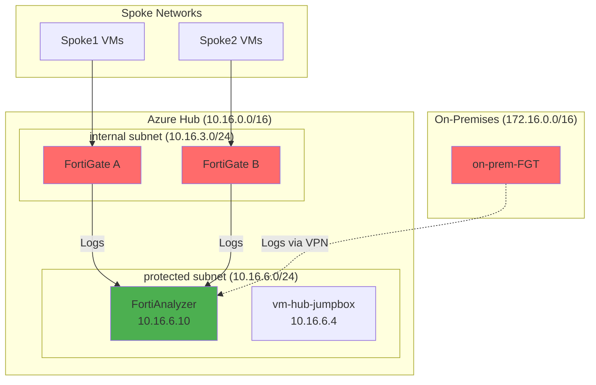
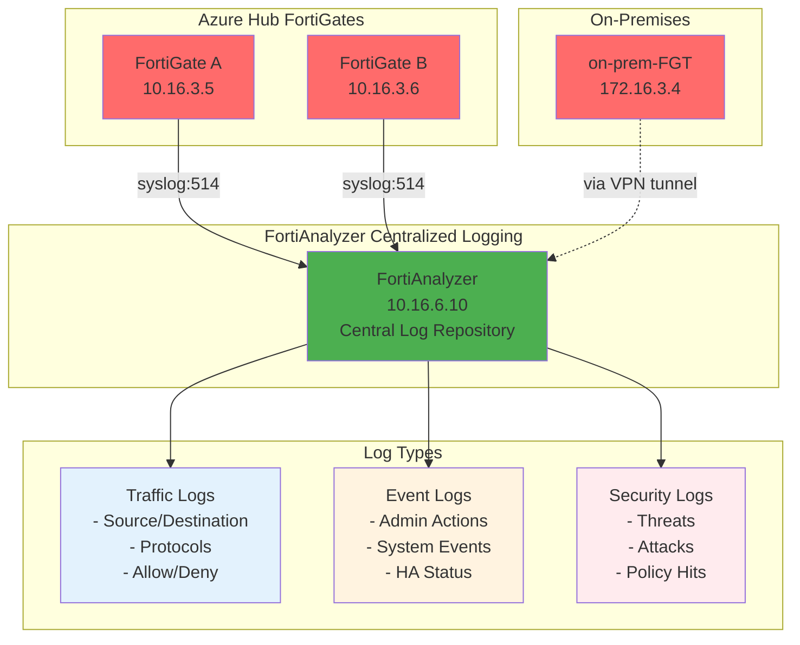

# Module 10 - FortiAnalyzer Deployment

## Centralized Logging and Analytics

### Overview

FortiAnalyzer provides centralized logging, reporting, and analytics for all FortiGate devices in your security fabric. In this module, we'll deploy FortiAnalyzer in the Azure hub network and configure it to collect logs from both the Azure FortiGate cluster and the on-premises FortiGate.

### Learning Objectives

By the end of this module, you will have:

- Deployed FortiAnalyzer VM in the Azure hub network
- Configured log forwarding from Azure FortiGate cluster
- Set up log collection from on-premises FortiGate
- Explored FortiAnalyzer's reporting and analytics capabilities
- Established centralized security monitoring

---

## Understanding FortiAnalyzer Architecture

### Deployment Overview



---

## Step 1: Deploy FortiAnalyzer VM

### 1.1 Start FortiAnalyzer Deployment

1. Navigate to **`rg-hub-bootcamp`** resource group
2. Click **"+ Create"**
3. Search for: **`FortiAnalyzer`**
4. Select **"FortiAnalyzer Centralized Log Analytics by Fortinet"**
5. Click **"Create"**
6. Select **Fortinet Analyzer - Single VM**

### 1.2 Configure Basic Settings

1. **Basics** configuration:
   - **Subscription**: Your subscription
   - **Resource group**: `rg-hub-bootcamp`
   - **Region**: `Canada Central`
   - **Virtual machine name**: `FortiAnalyzer`
   - **Username**: `fortinetuser`
   - **Password**: Create a strong password
   - **FortiAnalyzer Name Prefix**: hub
   - **FortiAnalyzer Image SKU**: Bring Your Own License
   - **FortiAnalyzer Image Version**: `7.6.3`

### 1.4 Configure Instance Settings

1. **Instance Type**: `Standard_D4s_v5` (4 vCPUs, 16 GB RAM)
2. **Storage**: `512GiB` - Keep default settings (Premium SSD)
Availability Option: `No infrastructure redundancy required`
My organisation is using the FortiFlex subscription service.: `Checked`
FortiAnalyzer FortiFlex: Token provided by your instructor
Name of the FortiAnalyzer VM: `hub-faz`

### 1.3 Configure Networking

1. **Networking** configuration:
   - **Virtual network**: `vnet-hub`
   - **Subnet**: `protected (10.16.6.0/24)`
   - **Public IP**: `None` (access via Bastion)

### 1.5 Deploy

1. Click "Review + create" then "Create"
2. Wait for deployment to complete (~5-10 minutes)
3. Click **"Review + create"** then **"Create"**

### 1.5 Wait for Deployment

FortiAnalyzer deployment typically takes 5-10 minutes.

---

> [!NOTE]
> Using a static IP makes configuration easier and ensures consistent connectivity even after VM restarts.

Define a fixed ip address for fortianalyzer

1. in the rg-hub-bootcamp
2. go to `azure-faz-nic1`
3. settings > IP configurations
4. ipconfig1
   - Edit IP Configuration
   - Private IP address `10.16.6.10`
   - Save

## Step 2: Initial FortiAnalyzer Configuration

### 2.1 Load the license

1. Connect to **`vm-hub-jumpbox`** via Bastion
2. Open a command prompt
3. Open an SSH session to the FortiAnalyzer

   ```bash
   ssh fortinetuser@10.16.6.10
   ```

4. Run the command to load the FortiFlex license using the token gave to you by the instructor

   ```bash
   execute vm-license < FortiFlex token>
   ```

5. The FortiAnalyzer will reboot
6. Close the command prompt

### 2.2 Access FortiAnalyzer

1. Open web browser
2. Navigate to: `https://10.16.6.510`
3. Accept security certificate warnings

### 2.3 Basic System Configuration

1. **System Settings > Settings**:
   - **Timezone**: Select your timezone
   - **Idle timeout (GUI)**: `3600` Seconds (1 hour)

---

## Step 3: Configure Azure FortiGate Log Forwarding

### 3.1 Access Azure FortiGate A

1. From the hub jumpbox, open a new browser tab
2. Navigate to the FortiGate A management IP
3. Login with FortiGate credentials

### 3.2 Configure FortiAnalyzer Connector

1. Navigate to **Security Fabric** → **Fabric Connectors**
2. Click on **FortiAnalyzer**
3. Click **"Edit"**
4. Configure the connector:
   - **Status**: `Enable`
   - **Server**: `10.16.6.10`
   - **Upload Option**: `Real Time`
5. Click **"OK"** to apply changes

### 3.3 Accept FortiAnalyzer Certificate

1. Accept the FortiAnalyzer certificate when prompted
2. Wait for connection establishment

### 3.4 Authorize Device in FortiAnalyzer

1. From the jumpbox, open Microsoft Edge
2. Navigate to: `https://10.16.6.10`
3. Complete FortiAnalyzer basic setup if prompted
4. Navigate to **Device Manager**
5. Click **"Unauthorized Devices"**
6. Select the Azure FortiGate device
7. Click **"Authorize"**

### 3.5 Verify Connection Status

1. Wait a few minutes for connection establishment
2. Refresh the FortiAnalyzer page
3. Verify connection status shows as connected
4. Return to the FortiGate and check **Security Fabric** → **Fabric Connectors** for connection status

### 3.6 Repeat for Azure FortiGate B

1. Access FortiGate B management interface
2. Follow steps 3.2-3.5 for FortiGate B
3. Authorize the second device in FortiAnalyzer

### 3.7 Configure On-Premises FortiGate

1. Access the on-premises FortiGate web interface
2. Repeat the same configuration process (steps 3.2-3.5)
3. Use the same FortiAnalyzer IP: `10.16.6.10`

## Step 3: Configure Azure FortiGate Log Forwarding

### 3.1 Access Azure FortiGate

1. Open new browser tab from jumpbox
2. Navigate to FortiGate A management IP
3. Login with FortiGate credentials

1. Go to **Security Fabric > Fabric Connectors**, then click on FortiAnalyzer, Edit

12- Click on “Enabled”, then enter the following information. Click on “ok” to apply the changes:
- Server: `10.16.6.10`
- Upload option: “Real Time”


13- Accept the FortiAnalyzer certificate

14- Authorize the on-premises FortiGate in the FortiAnalyzer.

To do this, connect to the Windows VM via Azure Bastion.
Open a webpage with Microsoft Edge to the FortiAnalyzer IP address (https://
10.16.6.10).
Go through the basic setup windows. Click on “Device Manager”


15-Click on “Unauthorized Devices”


16-Select the on-premises FortiGate, then click “Authorize”


17-After a few minutes, refresh the page and check the connection status.

Go back to FortiGate

18-Check the connection status through the firewall as well (“Security Fabric” -> “
Fabric Connectors »)

Repeat for the Fortigate on-prem


### 3.5 Repeat for FortiGate B

1. Access FortiGate B using its management IP
2. Configure identical log settings as FortiGate A
3. Ensure both FortiGates send logs to the same FortiAnalyzer

---

## Step 3.1

### 3.3 Configure Event Logging

1. In **Log Settings**, click **"Event Logging"**
2. Enable logging for:

UUIDs in Traffic Log
 - Address: Enabled

Log Settings
- Event logging: All
- Local traffic logging: All
- Syslog logging: Disable

GUI Preferences
- Resolve hostnames: Enabled
- Resolve unknown applications: Enabled

   - **System Events**: `Enable`
   - **Configuration Changes**: `Enable`
   - **Admin Login**: `Enable`
   - **HA Events**: `Enable`
3. Set **Send to Log Server**: `Enable`
4. Click **"Apply"**

### 3.4 Configure Traffic Logging

1. Navigate to **Policy & Objects** → **Firewall Policy**
2. Edit each existing policy (internet_access, spoke policies, etc.)
3. In **Security Profiles** section:
   - **Log Allowed Traffic**: `All Sessions`
   - **Log Denied Traffic**: `Enable`
4. Click **"OK"** for each policy

### 3.5 Repeat for FortiGate B

1. Access FortiGate B using its management IP
2. Configure identical log settings as FortiGate A
3. Ensure both FortiGates send logs to the same FortiAnalyzer

---

## Step 6: Generate and View Log Data

### 6.1 Generate Traffic for Logging

1. From various VMs, generate different types of traffic:

   ```bash
   # Internet access (generates traffic logs)
   curl https://www.fortinet.com
   curl https://www.yahoo.com
   
   # Inter-spoke traffic
   ssh azureuser@192.168.2.4
   
   # Cross-site traffic through VPN
   ssh azureuser@172.16.4.4
   ```

---

## Step 7: Explore FortiAnalyzer Features

### 7.1 Dashboard Overview

1. Navigate to **Dashboard** → **Status**
2. Explore widgets

### 7.1 FortiView Overview

1. Navigate to **FortiView** → **Local System Performance**
2. Explore widgets:

### 7.2 View Traffic Logs

1. In FortiAnalyzer, navigate to **Log View** → **Logs**
2. Observe real-time logs from all FortiGates
3. Filter by:
   - **Source Device**: Select specific FortiGate
   - **Source IP**: Filter by subnet
   - **Destination**: Filter by destination networks

   # Why I cant see ICMP logs? #

### 7.3 View Event Logs

1. Navigate to **Incidents & Events** → **Event Monitor**
2. Explore the tabs:
   - All events
   - By Endpoint
   - By Threat
   - System Events

---

## Verification Checklist

Before proceeding to Module 11, verify you have completed:

**FortiAnalyzer Deployment:**

- [ ] Deployed FortiAnalyzer VM with static IP 10.16.6.10
- [ ] Completed initial setup and admin password configuration
- [ ] Configured timezone and system settings

**Log Configuration:**

- [ ] Configured Azure FortiGate A Security Fabric to send logs to FortiAnalyzer
- [ ] Configured Azure FortiGate B ecurity Fabric to send logs to FortiAnalyzer
- [ ] Configured on-premises FortiGate to send logs via VPN
- [ ] Enabled traffic logging on all firewall policies

**Device Registration:**

- [ ] Added all three FortiGates to FortiAnalyzer device list
- [ ] Verified connectivity status shows as connected
- [ ] Generated test traffic and confirmed logs are being received

**Analytics Verification:**

- [ ] Viewed traffic logs from all devices
- [ ] Reviewed event logs for system activities
- [ ] Explored dashboard and reporting features

---

## Architecture Review

After completing this module, your logging architecture should look like this:



---

## Troubleshooting Common Issues

### Issue: FortiAnalyzer not receiving logs

**Solution:**

- Verify if FortiGate Fabric Connectors for FortiAnalyzer is `Connected`
- Check that traffic logging is enabled on firewall policies

### Issue: On-premises logs not appearing

**Solution:**

- Verify VPN tunnel is established and stable
- Check that on-premises FortiGate can reach 10.16.6.10 through tunnel
- Confirm remote logging configuration on on-premises device

### Issue: Device registration fails

**Solution:**

- Verify IP addresses are correct and reachable
- Check admin credentials are correct
- Ensure devices are not behind additional firewalls blocking management traffic

---

## Next Steps

Once you've completed this module and verified centralized logging, you're ready to proceed to **Module 11: FortiManager Deployment**.

Module 11 will complete the Security Fabric with centralized management and policy distribution.

**Estimated completion time**: 35-40 minutes
