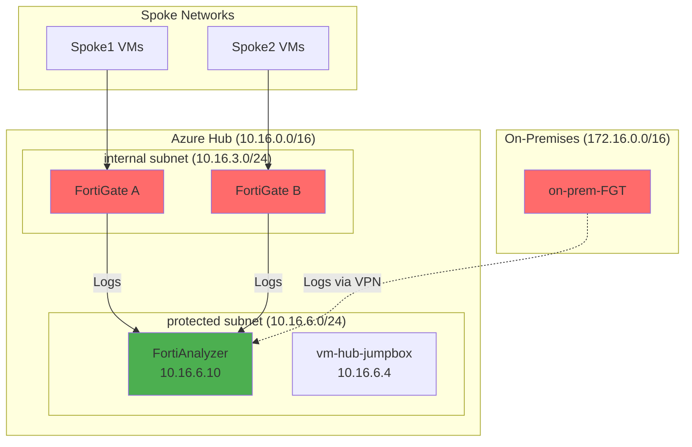
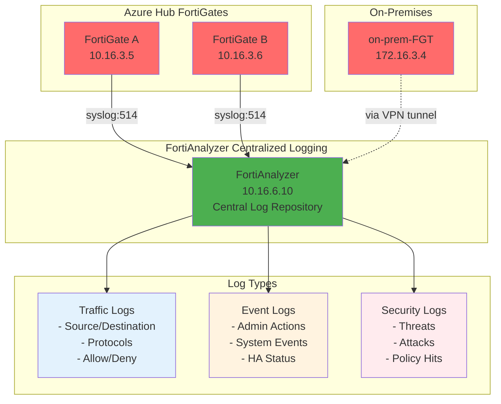

# Module 10 - FortiAnalyzer Deployment

## Centralized Logging and Analytics

### Overview
FortiAnalyzer provides centralized logging, reporting, and analytics for all FortiGate devices in your security fabric. In this module, we'll deploy FortiAnalyzer in the Azure hub network and configure it to collect logs from both the Azure FortiGate cluster and the on-premises FortiGate.

### Learning Objectives
By the end of this module, you will have:
- Deployed FortiAnalyzer VM in the Azure hub network
- Configured log forwarding from Azure FortiGate cluster
- Set up log collection from on-premises FortiGate
- Explored FortiAnalyzer's reporting and analytics capabilities
- Established centralized security monitoring

---

## Understanding FortiAnalyzer Architecture

### Deployment Overview


---

## Step 1: Deploy FortiAnalyzer VM

### 1.1 Start FortiAnalyzer Deployment
1. Navigate to **`rg-hub-bootcamp`** resource group
2. Click **"+ Create"**
3. Search for: **`FortiAnalyzer`**
4. Select **"Fortinet FortiAnalyzer"**
5. Select **Single VM**
5. Click **"Create"**

### 1.2 Configure Basic Settings
1. **Basics** configuration:
   - **Subscription**: Your subscription
   - **Resource group**: `rg-hub-bootcamp`
   - **Region**: `Canada Central`
   - **Virtual machine name**: `FortiAnalyzer`
   - **Username**: `fortinetuser`
   - **Password**: Create a strong password
   - **FortiAnalyzer Name Prefix**: hub
   - **FortiAnalyzer Image Version**: `7.6.3`
   - **FortiAnalyzer Image SKU**: Bring Your Own License

### 1.4 Configure Instance Settings
1. **Instance Type**: `Standard_D4s_v3` (4 vCPUs, 16 GB RAM)
2. **Storage**: `512GiB` - Keep default settings (Premium SSD)
Availability Option: `No infrastructure redundancy required`
My organisation is using the FortiFlex subscription service.: `Checked`
FortiAnalyzer FortiFlex: Token provided by your instructor
Name of the FortiAnalyzer VM: `hub-faz`


### 1.3 Configure Networking
1. **Networking** configuration:
   - **Virtual network**: `vnet-hub`
   - **Subnet**: `protected (10.16.6.0/24)`
   - **Public IP**: `None` (access via Bastion)

Review + create 
Create

> [!NOTE]
> Using a static IP makes configuration easier and ensures consistent connectivity even after VM restarts.


3. Click **"Review + create"** then **"Create"**

### 1.5 Wait for Deployment
FortiAnalyzer deployment typically takes 5-10 minutes.

---

## Step 2: Initial FortiAnalyzer Configuration

### 2.1 Access FortiAnalyzer
1. Connect to **`vm-hub-jumpbox`** via Bastion
2. Open web browser
3. Navigate to: `https://10.16.6.5`
4. Accept security certificate warnings

### 2.2 Initial Setup
1. **License Agreement**: Accept the license terms
2. **Admin Password Setup**:
   - **Username**: `fortinetuser`
   - **New Password**: `Chicken12345!`
   - **Confirm Password**: `Chicken12345!`
3. Click **"Apply"**

### 2.3 Basic System Configuration
1. **System Settings** → **Admin** → **Settings**:
   - **Timezone**: Select your timezone
   - **Idle timeout**: `60` minutes
2. **System Settings** → **Network** → **Interface**:
   - Verify interface settings show correct IP (10.16.6.10)

---

## Step 3: Configure Azure FortiGate Log Forwarding

### 3.1 Access Azure FortiGate A
1. Open new browser tab from jumpbox
2. Navigate to FortiGate A management IP
3. Login with FortiGate credentials

### 3.2 Configure Log Server Settings
1. Navigate to **Log & Report** → **Log Settings**
2. Click **"Log Server"**
3. Configure log server:
   - **IP/FQDN**: `10.16.6.10`
   - **Port**: `514` (default syslog)
   - **Mode**: `Reliable`
   - **Facility**: `Local7`
4. Click **"Apply"**

### 3.3 Configure Event Logging
1. In **Log Settings**, click **"Event Logging"**
2. Enable logging for:
   - **System Events**: `Enable`
   - **Configuration Changes**: `Enable`
   - **Admin Login**: `Enable`
   - **HA Events**: `Enable`
3. Set **Send to Log Server**: `Enable`
4. Click **"Apply"**

### 3.4 Configure Traffic Logging
1. Navigate to **Policy & Objects** → **Firewall Policy**
2. Edit each existing policy (internet_access, spoke policies, etc.)
3. In **Security Profiles** section:
   - **Log Allowed Traffic**: `All Sessions`
   - **Log Denied Traffic**: `Enable`
4. Click **"OK"** for each policy

### 3.5 Repeat for FortiGate B
1. Access FortiGate B using its management IP
2. Configure identical log settings as FortiGate A
3. Ensure both FortiGates send logs to the same FortiAnalyzer

---

## Step 4: Configure On-Premises FortiGate Logging

### 4.1 Access On-Premises FortiGate
1. From a separate browser/device, access on-premises FortiGate
2. Use the public IP from `pip-on-prem-fgt`

### 4.2 Configure Remote Log Server
1. Navigate to **Log & Report** → **Log Settings**
2. Click **"Remote Logging and Archiving"**
3. Click **"Create New"**
4. Configure:
   - **Name**: `Azure_FortiAnalyzer`
   - **Type**: `FortiAnalyzer`
   - **IP**: `10.16.6.10`
   - **Port**: `514`
   - **Reliable**: `Enable`
5. Click **"OK"**

### 4.3 Enable Log Forwarding
1. In **Log Settings**, configure categories:
   - **Traffic Log**: Send to `Azure_FortiAnalyzer`
   - **Event Log**: Send to `Azure_FortiAnalyzer`
   - **Security Log**: Send to `Azure_FortiAnalyzer`
2. Click **"Apply"**

---

## Step 5: Register FortiGates with FortiAnalyzer

### 5.1 Add Azure FortiGate A
1. In FortiAnalyzer web interface, navigate to **Device Manager** → **Device & Groups**
2. Click **"Add Device"**
3. Configure:
   - **Device Name**: `Azure-FortiGate-A`
   - **IP Address**: `10.16.3.5` (FortiGate A internal IP)
   - **Administrator**: `fortinetuser`
   - **Password**: `Chicken12345!`
4. Click **"Add"**

### 5.2 Add Azure FortiGate B
1. Click **"Add Device"** again
2. Configure:
   - **Device Name**: `Azure-FortiGate-B`
   - **IP Address**: `10.16.3.6` (FortiGate B internal IP)
   - **Administrator**: `fortinetuser`
   - **Password**: `Chicken12345!`
4. Click **"Add"**

### 5.3 Add On-Premises FortiGate
1. Click **"Add Device"** again
2. Configure:
   - **Device Name**: `OnPrem-FortiGate`
   - **IP Address**: `172.16.3.4` (via VPN tunnel)
   - **Administrator**: `fortinetuser`
   - **Password**: `Chicken12345!`
4. Click **"Add"**

---

## Step 6: Generate and View Log Data

### 6.1 Generate Traffic for Logging
1. From various VMs, generate different types of traffic:
   ```bash
   # Internet access (generates traffic logs)
   curl https://www.google.com
   curl https://www.microsoft.com
   
   # Inter-spoke traffic
   ping 192.168.2.4
   
   # Cross-site traffic through VPN
   ping 172.16.4.4
   ```

### 6.2 View Traffic Logs
1. In FortiAnalyzer, navigate to **Log View** → **Traffic Log**
2. Observe real-time logs from all FortiGates
3. Filter by:
   - **Source Device**: Select specific FortiGate
   - **Source IP**: Filter by subnet
   - **Destination**: Filter by destination networks

### 6.3 View Event Logs
1. Navigate to **Log View** → **Event Log**
2. Look for:
   - Admin login events
   - Configuration changes
   - VPN tunnel status events
   - HA status changes

---

## Step 7: Explore FortiAnalyzer Features

### 7.1 Dashboard Overview
1. Navigate to **FortiView** → **Dashboard**
2. Explore widgets:
   - **Top Sources** by traffic volume
   - **Top Destinations** 
   - **Top Applications**
   - **Security Events**

### 7.2 Create Custom Reports
1. Navigate to **Reports** → **Generate**
2. Create a new report:
   - **Template**: Traffic Summary
   - **Time Period**: Last 1 hour
   - **Devices**: All FortiGates
3. Generate and review the report

### 7.3 Set Up Real-Time Monitoring
1. Navigate to **FortiView** → **Console**
2. Set up real-time monitoring for:
   - Traffic patterns
   - Security events
   - System performance

---

## Verification Checklist

Before proceeding to Module 11, verify you have completed:

**FortiAnalyzer Deployment:**
- [ ] Deployed FortiAnalyzer VM with static IP 10.16.6.10
- [ ] Completed initial setup and admin password configuration
- [ ] Configured timezone and system settings

**Log Configuration:**
- [ ] Configured Azure FortiGate A to send logs to FortiAnalyzer
- [ ] Configured Azure FortiGate B to send logs to FortiAnalyzer
- [ ] Configured on-premises FortiGate to send logs via VPN
- [ ] Enabled traffic logging on all firewall policies

**Device Registration:**
- [ ] Added all three FortiGates to FortiAnalyzer device list
- [ ] Verified connectivity status shows as connected
- [ ] Generated test traffic and confirmed logs are being received

**Analytics Verification:**
- [ ] Viewed traffic logs from all devices
- [ ] Reviewed event logs for system activities
- [ ] Explored dashboard and reporting features

---

## Architecture Review

After completing this module, your logging architecture should look like this:



---

## Troubleshooting Common Issues

### Issue: FortiAnalyzer not receiving logs
**Solution:**
- Verify FortiGate log server configuration points to 10.16.6.10
- Check that traffic logging is enabled on firewall policies
- Ensure FortiAnalyzer is accepting logs on port 514

### Issue: On-premises logs not appearing
**Solution:**
- Verify VPN tunnel is established and stable
- Check that on-premises FortiGate can reach 10.16.6.10 through tunnel
- Confirm remote logging configuration on on-premises device

### Issue: Device registration fails
**Solution:**
- Verify IP addresses are correct and reachable
- Check admin credentials are correct
- Ensure devices are not behind additional firewalls blocking management traffic

---

## Next Steps

Once you've completed this module and verified centralized logging, you're ready to proceed to **Module 11: FortiManager Deployment**.

Module 11 will complete the Security Fabric with centralized management and policy distribution.

**Estimated completion time**: 35-40 minutes