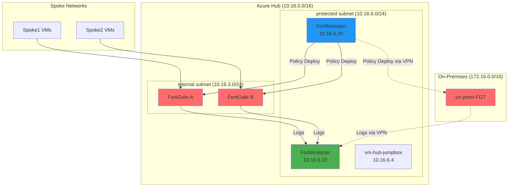
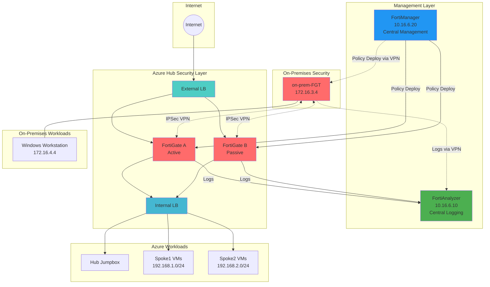

# Module 11 - FortiManager Deployment

## Centralized Security Management and Policy Orchestration

### Overview
FortiManager provides centralized management, configuration, and policy orchestration for all FortiGate devices in your security fabric. In this final module, we'll deploy FortiManager in the Azure hub network and configure it to manage both the Azure FortiGate cluster and the on-premises FortiGate, completing our comprehensive Fortinet Security Fabric.

### Learning Objectives
By the end of this module, you will have:
- Deployed FortiManager VM in the Azure hub network
- Configured centralized management for all FortiGate devices
- Created and deployed unified security policies across the fabric
- Explored FortiManager's configuration management capabilities
- Established a complete, centrally-managed security infrastructure

---

## Understanding FortiManager Architecture

### Management Overview


**FortiManager Capabilities:**
- **Centralized Policy Management**: Create and deploy policies across all devices
- **Configuration Templates**: Standardize configurations across the fabric
- **Device Provisioning**: Automated device onboarding and setup
- **Change Management**: Track, approve, and audit configuration changes
- **Firmware Management**: Centralized firmware updates and scheduling

---

## Step 1: Deploy FortiManager VM

### 1.1 Start FortiManager Deployment
1. Navigate to **`rg-hub-bootcamp`** resource group
2. Click **"+ Create"**
3. Search for: **`FortiManager`**
4. Select **"Fortinet FortiManager"**
5. Click **"Create"**

### 1.2 Configure Basic Settings
1. **Basics** configuration:
   - **Subscription**: Your subscription
   - **Resource group**: `rg-hub-bootcamp`
   - **Region**: `Canada Central`
   - **Virtual machine name**: `FortiManager`
   - **Username**: `fortinetuser`
   - **Password**: `Chicken12345!`
   - **FortiManager Image Version**: `7.4.5`
   - **Instance Type**: `Standard_D4s_v3` (4 vCPUs, 16 GB RAM)

### 1.3 Configure Networking
1. **Networking** configuration:
   - **Virtual network**: `vnet-hub`
   - **Subnet**: `protected (10.16.6.0/24)`
   - **Public IP**: `None` (access via Bastion)
   - **Private IP assignment**: `Static`
   - **Private IP address**: `10.16.6.20`

> [!NOTE]
> Using a static IP ensures consistent management connectivity and makes device registration easier.

### 1.4 Configure Storage and Management
1. **Storage**: Keep default settings (Premium SSD)
2. **Management**: 
   - **Boot diagnostics**: `Enabled`
   - **Monitoring**: Keep defaults
3. Click **"Review + create"** then **"Create"**

### 1.5 Wait for Deployment
FortiManager deployment typically takes 5-10 minutes.

---

## Step 2: Initial FortiManager Configuration

### 2.1 Access FortiManager
1. Connect to **`vm-hub-jumpbox`** via Bastion
2. Open web browser
3. Navigate to: `https://10.16.6.20`
4. Accept security certificate warnings

### 2.2 Initial Setup
1. **License Agreement**: Accept the license terms
2. **Admin Password Setup**:
   - **Username**: `admin`
   - **New Password**: `Chicken12345!`
   - **Confirm Password**: `Chicken12345!`
3. Click **"Apply"**

### 2.3 Basic System Configuration
1. **System Settings** → **Admin** → **Settings**:
   - **Timezone**: Select your timezone
   - **Idle timeout**: `60` minutes
2. **System Settings** → **Network** → **Interface**:
   - Verify interface settings show correct IP (10.16.6.20)

---

## Step 3: Add FortiGate Devices to FortiManager

### 3.1 Configure Azure FortiGate A for Management
1. Access Azure FortiGate A management interface
2. Navigate to **System** → **FortiManager**
3. Configure:
   - **Central Management**: `Enable`
   - **Server IP/FQDN**: `10.16.6.20`
   - **Shared Secret**: `BootcampSecretKey2024`
4. Click **"Apply"**

### 3.2 Configure Azure FortiGate B for Management
1. Access Azure FortiGate B management interface
2. Navigate to **System** → **FortiManager**
3. Configure identical settings:
   - **Central Management**: `Enable`
   - **Server IP/FQDN**: `10.16.6.20`
   - **Shared Secret**: `BootcampSecretKey2024`
4. Click **"Apply"**

### 3.3 Configure On-Premises FortiGate for Management
1. Access on-premises FortiGate interface
2. Navigate to **System** → **FortiManager**
3. Configure:
   - **Central Management**: `Enable`
   - **Server IP/FQDN**: `10.16.6.20` (via VPN tunnel)
   - **Shared Secret**: `BootcampSecretKey2024`
4. Click **"Apply"**

---

## Step 4: Register Devices in FortiManager

### 4.1 Accept Device Registrations
1. In FortiManager, navigate to **Device Manager** → **Device & Groups**
2. You should see pending device registrations
3. For each device (Azure-FGT-A, Azure-FGT-B, OnPrem-FGT):
   - Right-click the device
   - Select **"Authorize"**
   - Verify the device details
   - Click **"OK"**

### 4.2 Organize Devices into Groups
1. In **Device & Groups**, create device groups:
   - **Azure-Hub-Cluster**: Add Azure FortiGate A and B
   - **On-Premises**: Add on-premises FortiGate
2. Right-click in the device tree → **"Add Group"**
3. Configure group names and add appropriate devices

### 4.3 Import Device Configurations
1. For each device, right-click → **"Import Policy Package"**
2. This imports existing configurations into FortiManager
3. Review imported policies under **Policy & Objects**

---

## Step 5: Create Unified Security Policies

### 5.1 Create Global Policy Package
1. Navigate to **Policy & Objects** → **Policy Packages**
2. Create new package:
   - **Name**: `Global-Security-Policies`
   - **Type**: `Policy Package`
   - **Description**: `Unified policies for entire security fabric`

### 5.2 Create Standard Security Policies
1. In the Global policy package, create policies:

**Internet Access Policy:**
- **Name**: `Standard-Internet-Access`
- **Source Interface**: `internal`
- **Destination Interface**: `external`
- **Source**: `all-internal-subnets`
- **Destination**: `all`
- **Service**: `HTTP, HTTPS, DNS, PING`
- **Action**: `Accept`
- **Security Profiles**: `Enable AV, IPS, Web Filter`

**Inter-Site Communication Policy:**
- **Name**: `Cross-Site-Access`
- **Source Interface**: `internal/VPN`
- **Destination Interface**: `VPN/internal`
- **Source**: `all-sites`
- **Destination**: `all-sites`
- **Service**: `ALL`
- **Action**: `Accept`

### 5.3 Create Address Objects and Groups
1. Navigate to **Policy & Objects** → **Addresses**
2. Create standard address objects:
   - **Azure-Hub-Subnets**: `10.16.0.0/16`
   - **Azure-Spoke1**: `192.168.1.0/24`
   - **Azure-Spoke2**: `192.168.2.0/24`
   - **OnPrem-Network**: `172.16.0.0/16`
3. Create address groups for easier policy management

---

## Step 6: Deploy Policies to Devices

### 6.1 Assign Policy Package to Devices
1. Navigate to **Device Manager** → **Device & Groups**
2. For each device/group:
   - Right-click → **"Assign Policy Package"**
   - Select **`Global-Security-Policies`**
   - Configure installation settings

### 6.2 Install Policies
1. Navigate to **Device Manager** → **Installation Wizard**
2. Select devices to update
3. **Installation Options**:
   - **Retrieve device configurations**: `Enable`
   - **Generate configuration script**: `Enable`
   - **Preview changes**: `Enable`
4. Click **"Next"** and review changes
5. Click **"Install"** to deploy policies

### 6.3 Monitor Installation Status
1. Monitor installation progress in **Task Monitor**
2. Verify successful installation on all devices
3. Check for any installation errors or warnings

---

## Step 7: Configuration Templates and Automation

### 7.1 Create Configuration Templates
1. Navigate to **Device Manager** → **Provisioning Templates**
2. Create template for standard FortiGate setup:
   - **Name**: `Standard-FortiGate-Template`
   - **Device Type**: `FortiGate`
3. Configure standard settings:
   - **Logging configuration**
   - **NTP settings**
   - **DNS settings**
   - **SNMP configuration**

### 7.2 Create CLI Templates
1. Navigate to **Device Manager** → **CLI Templates**
2. Create template for common configurations:
   ```bash
   config system global
       set timezone "America/Edmonton"
       set admin-timeout 60
   end
   
   config log syslogd setting
       set status enable
       set server "10.16.6.10"
       set port 514
   end
   ```

### 7.3 Apply Templates to Devices
1. Select target devices
2. Apply appropriate templates
3. Schedule template deployment during maintenance windows

---

## Step 8: Monitoring and Maintenance

### 8.1 Device Status Monitoring
1. Navigate to **System Settings** → **Dashboard**
2. Configure dashboard widgets:
   - **Device Status Overview**
   - **Policy Installation Status**
   - **Configuration Compliance**
   - **System Resources**

### 8.2 Configuration Backup and Restore
1. Navigate to **Device Manager** → **Backup & Restore**
2. Configure automatic backups:
   - **Schedule**: Daily at 2:00 AM
   - **Retention**: 30 days
   - **Location**: Local FortiManager storage

### 8.3 Firmware Management
1. Navigate to **Device Manager** → **Firmware Images**
2. Upload FortiGate firmware images
3. Schedule firmware updates:
   - **Maintenance Window**: Planned downtime
   - **Rollback Plan**: Automatic if health checks fail

---

## Step 9: Security Fabric Integration

### 9.1 Configure Security Fabric
1. Navigate to **Security Fabric** → **Fabric Connectors**
2. Add FortiAnalyzer connector:
   - **Connector Type**: `FortiAnalyzer`
   - **IP Address**: `10.16.6.10`
   - **Admin User**: `admin`
   - **Password**: `Chicken12345!`

### 9.2 Fabric-Wide Policy Deployment
1. Create fabric-wide security policies
2. Deploy consistent security posture across all devices
3. Monitor compliance through fabric dashboard

### 9.3 Centralized Threat Intelligence
1. Configure threat feed subscriptions
2. Deploy threat indicators across the fabric
3. Monitor threat detection and response

---

## Verification Checklist

Before completing the bootcamp, verify you have accomplished:

**FortiManager Deployment:**
- [ ] Deployed FortiManager VM with static IP 10.16.6.20
- [ ] Completed initial setup and admin password configuration
- [ ] Configured timezone and system settings

**Device Management:**
- [ ] Registered all three FortiGates with FortiManager
- [ ] Organized devices into logical groups
- [ ] Imported existing device configurations

**Policy Management:**
- [ ] Created global policy package with standard security policies
- [ ] Deployed unified policies to all devices
- [ ] Verified successful policy installation

**Automation and Templates:**
- [ ] Created configuration templates for standard settings
- [ ] Set up automated backup schedules
- [ ] Configured firmware management processes

**Security Fabric:**
- [ ] Integrated FortiAnalyzer with FortiManager
- [ ] Established fabric-wide security visibility
- [ ] Verified centralized management and monitoring capabilities

---

## Architecture Review - Complete Security Fabric

After completing all modules, your comprehensive Fortinet Security Fabric should look like this:



**Complete Security Fabric Features:**
- **Centralized Management**: All policies deployed from FortiManager
- **Unified Logging**: All traffic and events logged to FortiAnalyzer
- **High Availability**: Azure FortiGate cluster with automatic failover
- **Hybrid Connectivity**: Secure VPN between on-premises and cloud
- **Micro-Segmentation**: Granular control over all traffic flows
- **Zero-Trust Architecture**: All traffic inspected regardless of source/destination

---

## Congratulations!

You have successfully completed the **Fortinet Security Fabric Azure Bootcamp**! 

### What You've Accomplished:
1. **Built a comprehensive hybrid security architecture** spanning on-premises and Azure environments
2. **Deployed high-availability FortiGate clusters** with proper load balancing and failover
3. **Implemented centralized logging and analytics** with FortiAnalyzer
4. **Established centralized management and policy orchestration** with FortiManager
5. **Created secure site-to-site connectivity** with IPSec VPN tunnels
6. **Configured advanced networking** with hub-spoke topology and user-defined routes
7. **Applied zero-trust security principles** with comprehensive traffic inspection

### Next Steps for Production:
- **Security Profiles**: Configure IPS, AV, Web Filtering, and Application Control
- **High Availability Testing**: Validate failover scenarios and recovery procedures
- **Performance Optimization**: Tune FortiGate sizing and accelerated networking
- **Compliance Reporting**: Set up automated compliance and audit reports
- **Disaster Recovery**: Implement backup and recovery procedures for all components

### Thank You!
This bootcamp provided hands-on experience with enterprise-grade security infrastructure. The skills and architecture patterns you've learned are directly applicable to real-world deployments.

**Estimated completion time**: 40-45 minutes

---

## Final Architecture Summary

Your completed environment includes:
- **3 Resource Groups**: Hub, Spoke1, Spoke2, On-Premises
- **6+ Virtual Networks**: Hub, 2 Spokes, On-Premises with proper peering
- **5 FortiGate Instances**: 2 Azure HA cluster + 1 on-premises
- **2 Management VMs**: FortiAnalyzer and FortiManager
- **6 Workload VMs**: Windows and Linux across all environments
- **Complete Security Fabric**: Centralized management, logging, and policy enforcement