# Module 11 - Fortinet Security Fabric

## Building an Integrated Security Architecture

### Overview

The Fortinet Security Fabric provides an intelligent architecture that interconnects multiple security solutions to detect, monitor, block, and remediate attacks as quickly as possible. In this module, we'll configure the Security Fabric to connect our on-premises and Azure FortiGates into a unified security management platform.

### Learning Objectives

By the end of this module, you will have:

- Configured VPN tunnel interfaces for Security Fabric communication
- Established fabric connectivity between on-premises and Azure FortiGates
- Set up Root and Leaf fabric roles
- Demonstrated centralized visibility and management across the fabric
- Prepared the foundation for FortiManager integration

---

## Understanding Security Fabric Architecture

### What is Security Fabric?

The Fortinet Security Fabric creates a unified security architecture that:

- **Centralizes visibility** across all security devices
- **Shares threat intelligence** in real-time
- **Coordinates responses** to security events
- **Simplifies management** through unified interfaces
- **Scales seamlessly** from small deployments to enterprise-wide

### Fabric Topology

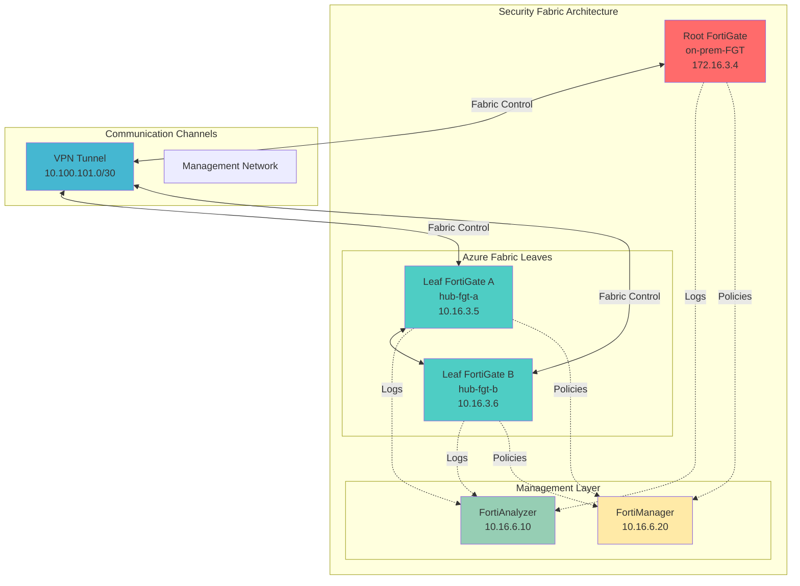

---

## Part A: Configure VPN Tunnel Interfaces

### Step 1: Configure On-Premises VPN Interface

#### 1.1 Access On-Premises FortiGate

1. Navigate to **on-premises FortiGate** public IP
2. Login with admin credentials

#### 1.2 Configure VPN Tunnel Interface

1. Navigate to **Network** → **Interfaces**
2. Under **port1**, find the VPN tunnel **`to_azure_hub`**
3. Click **"Edit"**

   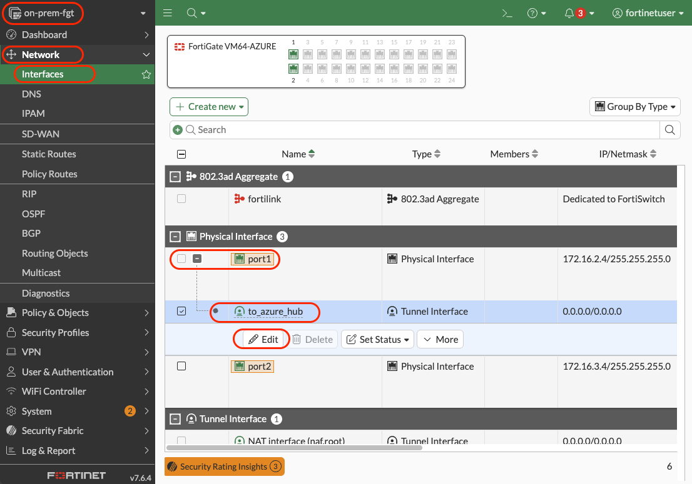

4. Configure interface addressing:
   - **IP**: `10.100.101.1`
   - **Remote IP/Netmask**: `10.100.101.2/32`
5. Click **"OK"**

   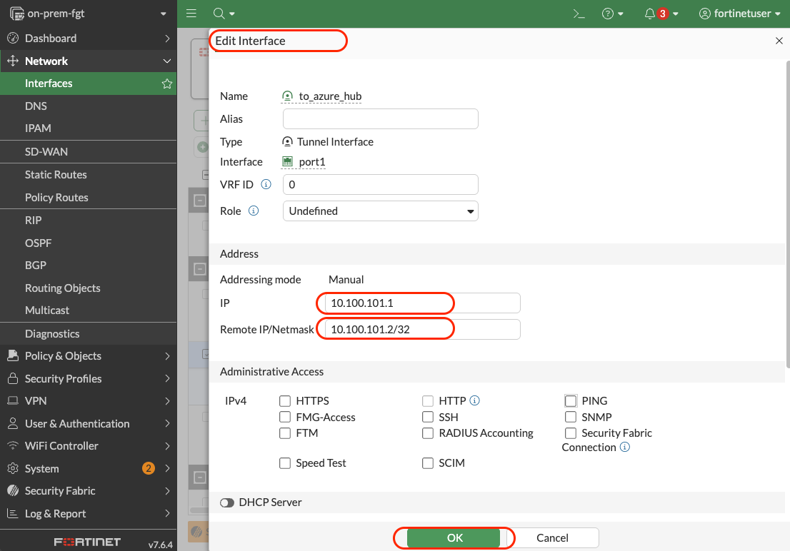

---

### Step 2: Configure Azure VPN Interface

#### 2.1 Access Azure FortiGate A

1. Navigate to Azure FortiGate A management interface
2. Login with admin credentials

#### 2.2 Configure VPN Tunnel Interface

1. Navigate to **Network** → **Interfaces**
2. Under **port1**, find the VPN tunnel **`to_on_prem`**
3. Click **"Edit"**
4. Configure interface addressing:
   - **IP/Network Mask**: `10.100.101.2`
   - **Remote IP/Netmask**: `10.100.101.1/32`
5. Click **"OK"**

---

### Step 3: Update VPN Address Objects

#### 3.1 Create Fabric Connection Address Object (On-Premises)

1. In on-premises FortiGate, navigate to **Policy & Objects** → **Addresses**
2. Click **"Create New"**
3. Configure:
   - **Name**: `fabric_connection`
   - **Color**: `Orange`
   - **Interface**: `Any`
   - **Type**: `Subnet`
   - **Subnet**: `10.100.101.0/24`

   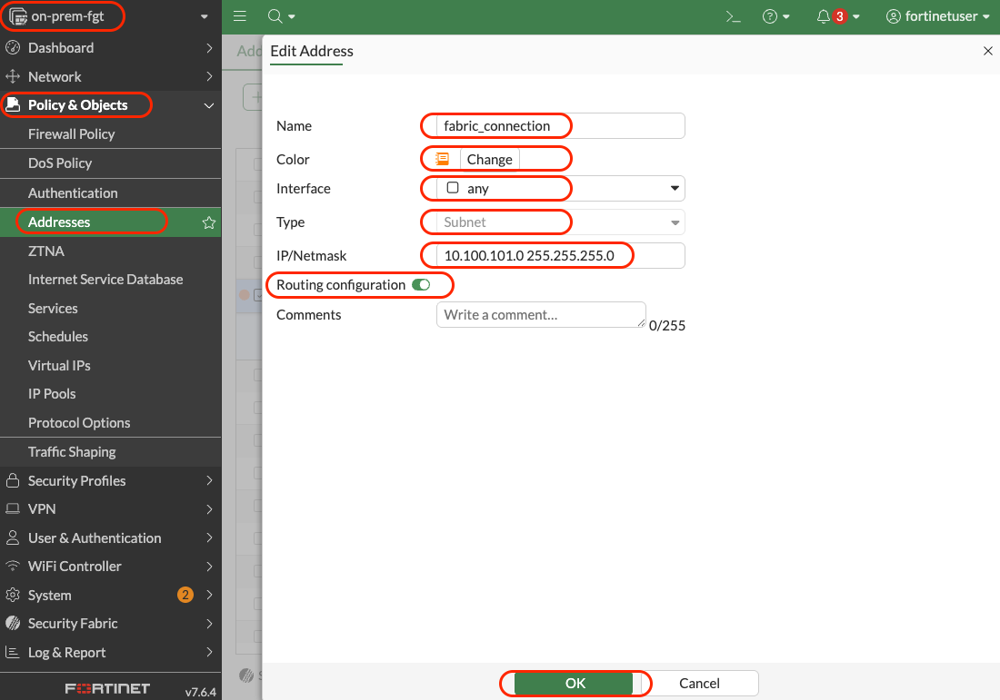

4. Click **"OK"**

#### 3.2 Update VPN Address Groups

1. Navigate to **Policy & Objects** → **Address Groups**
2. Edit **`to_azure_hub_local`** group:
   - Add **`fabric_connection`** to members
   - Click **"OK"**
3. Edit **`to_azure_hub_remote`** group:
   - Add **`fabric_connection`** to members
   - Click **"OK"**

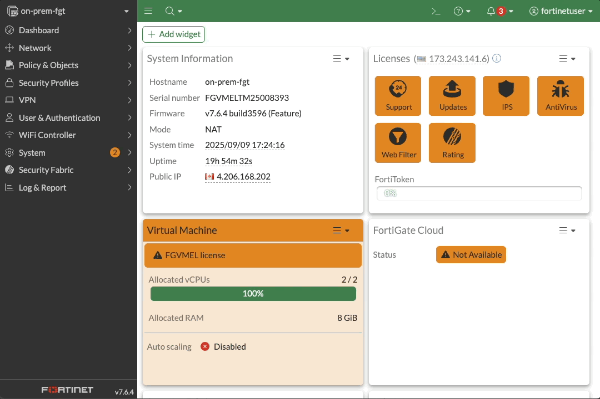

#### 3.3 Update Phase2 Configuration

1. Navigate to **VPN** → **IPsec Tunnels**
2. Edit the **`to_azure_hub`** tunnel
3. In **Phase 2 Selectors**:
   - **Local Address**: `all`
   - **Remote Address**: `all`
4. Click **"OK"**

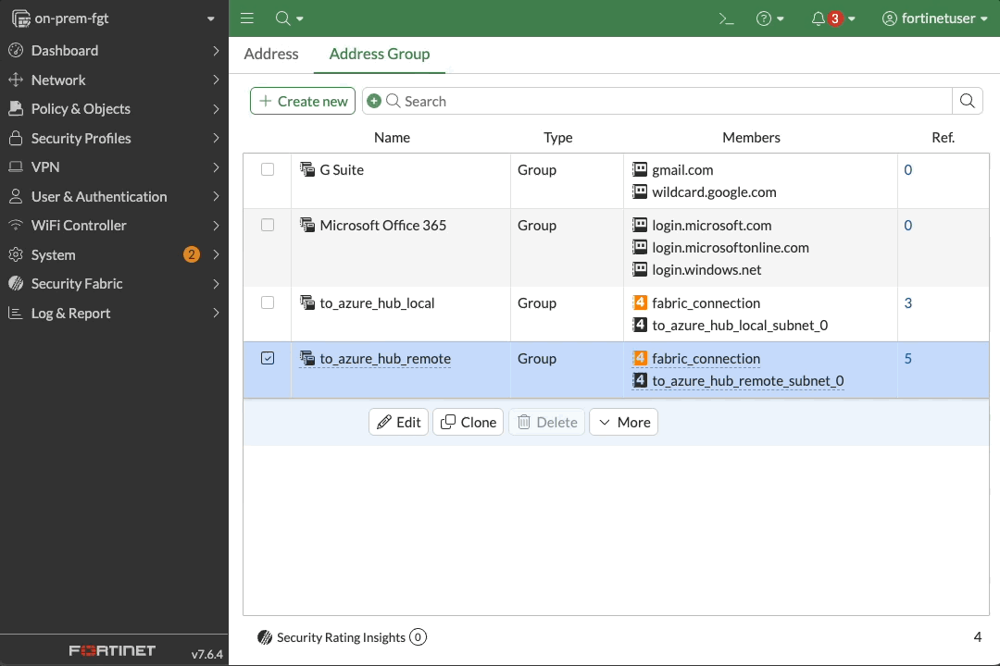

---

### Step 4: Update Azure VPN Configuration

#### 4.1 Repeat Address Configuration on Azure Side

1. In Azure FortiGate A, create same address objects and groups
2. Update the **`to_on_prem`** tunnel Phase2 selectors to `all`
3. Verify VPN tunnel status shows **"Up"**

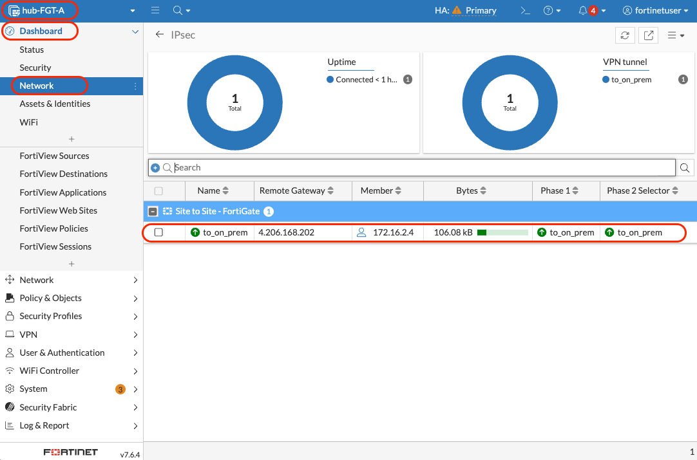

---

## Part B: Configure Security Fabric

### Step 5: Configure Root FortiGate (On-Premises)

#### 5.1 Access Fabric Configuration

1. In on-premises FortiGate, navigate to **Security Fabric** → **Fabric Connectors**
2. Click **"Edit"**

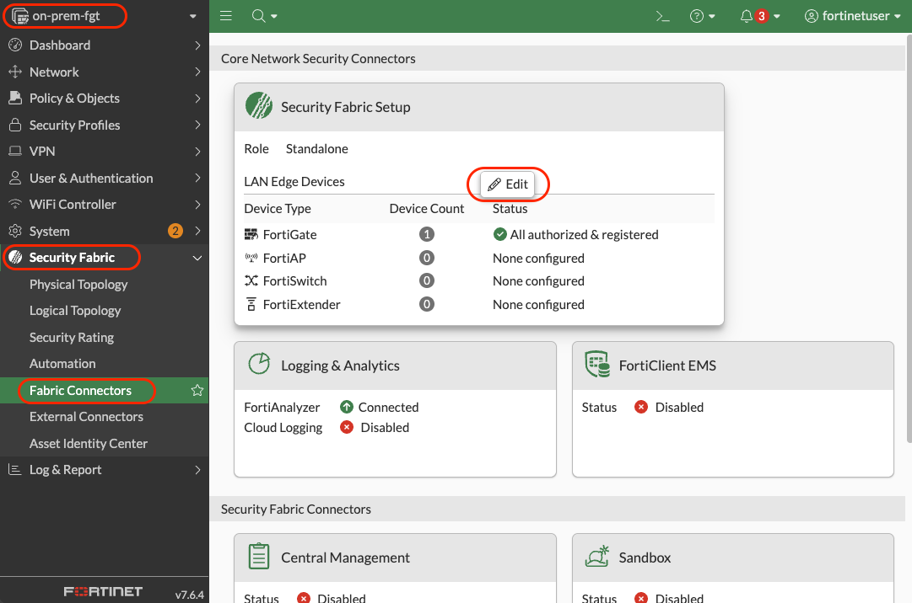

#### 5.2 Configure Root Settings

1. **Security Fabric Configuration**:
   - **Security Fabric Role**: `Serve as Fabric Root`
   - **Allow other Security Fabric devices to join**: `Enable`
     - `port2`
     - `to_azure_hub`
   - **Fabric Name**: `BootcampFabric`
   - **FortiCloud account enforcement**: `Disable` (for lab)
   - **Allow downstream device REST API access**: `Enable`
   - **Administrator profile**: `super_admin`
   - **Fabric global object**: `Enable`
   - **Management IP/FQDN**: `Use WAN IP`
   - **Management port**: `User Admin Port`

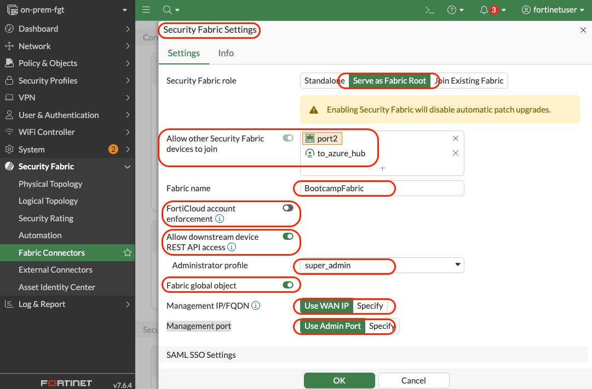

#### 5.3 Configure SAML SSO

1. **SAML Single Sign-On**:
   - **SAML Single Sign-On**: `Enable`
   - **Mode**: `Identity Provider (IdP)`
   - **IdP certificate**: `Fortinet_CA_SSL`
   - **IdP address**: `Specify`
   - **Management IP/FQDN**: `172.16.3.4`
   - **Management Port**: `Use Admin Port`

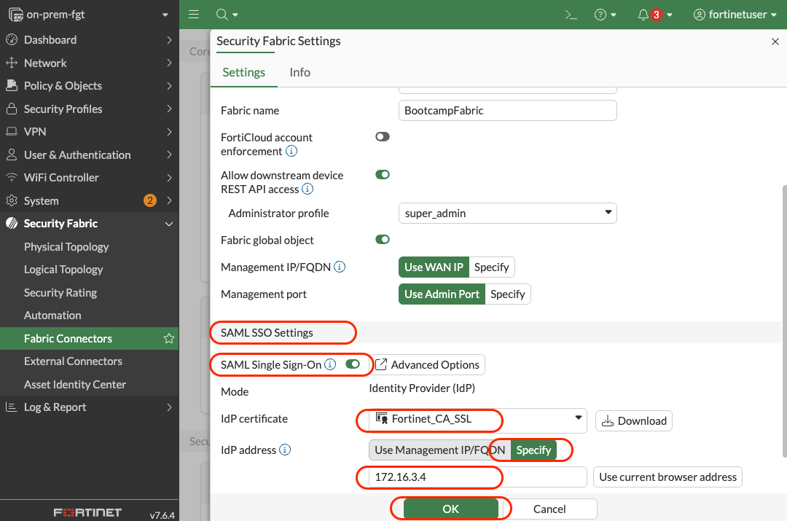

#### 5.4 Configure Device Authorization

1. In **Device authorization** section, click **"Edit"**
2. Click **"Create New"** for each Azure FortiGate:

   **Device 1 (FortiGate A):**

   - **Device Name**: `hub-FGT-A`
   - **Serial Number**: `[Get from Azure FortiGate A Dashboard → Status]`

   !device-autorization-fgt-a](images/5.4-device-authorization.gif)

   **Device 2 (FortiGate B):**

   - **Device Name**: `hub-FGT-B`
   - **Serial Number**: `[Get from Azure FortiGate B Dashboard → Status]`

3. Click **"OK"** to save configuration

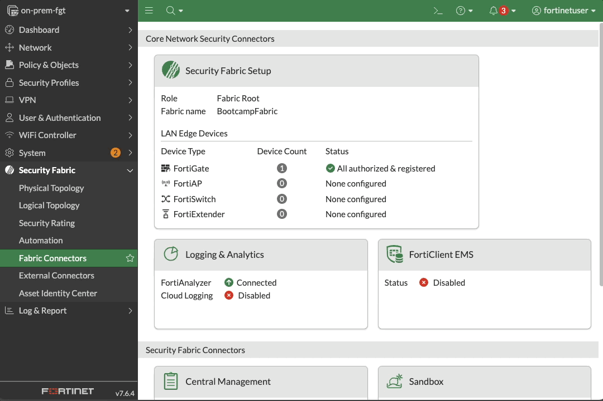

> [!TIP]
> **Finding Serial Numbers**: Navigate to each FortiGate's **Dashboard** → **Status** and look under **System Information** for the serial number.

---

### Step 6: Configure Leaf FortiGate (Azure)

#### 6.1 Access Azure FortiGate A Fabric Configuration

1. Navigate to **Security Fabric** → **Fabric Connectors**
2. Click **"Edit"**

#### 6.2 Configure Leaf Settings

1. **Security Fabric Configuration**:
   - **Security Fabric Role**: `Join Existing Fabric`
   - **Allow other Security Fabric devices to join**: `Disable`
   - **Upstream FortiGate IP/FQDN**: `10.100.101.1`
   - **Allow downstream device REST API access**: `Disable`
   - **Management IP/FQDN**: `Specify: 10.16.3.5`
   - **Management Port**: `Use Admin Port`
2. **SAML Single Sign-On**:
   - **SAML Single Sign-On**: `Auto`
   - **Default login page**: `Normal`
   - **Default admin profile**: `super_admin`

   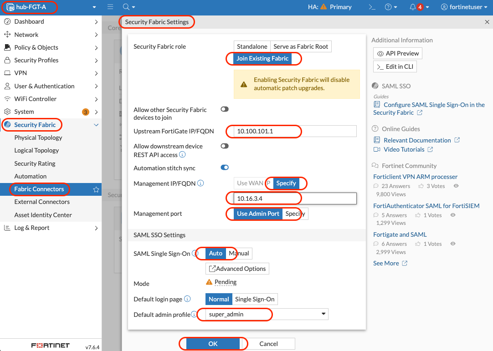

3. Click **"OK"** to save configuration

---

## Part C: Verify and Test Security Fabric

### Step 7: Verify Fabric Status

#### 7.1 Check Fabric Topology on Root

1. In on-premises FortiGate, navigate to **Security Fabric** → **Physical Topology**
2. Verify connected devices show:
   - **Root**: on-prem-fgt (connected)
   - **Leaves**: HA: Active-Passive [hub-FTG-A, hub-FGT-B] (connected)

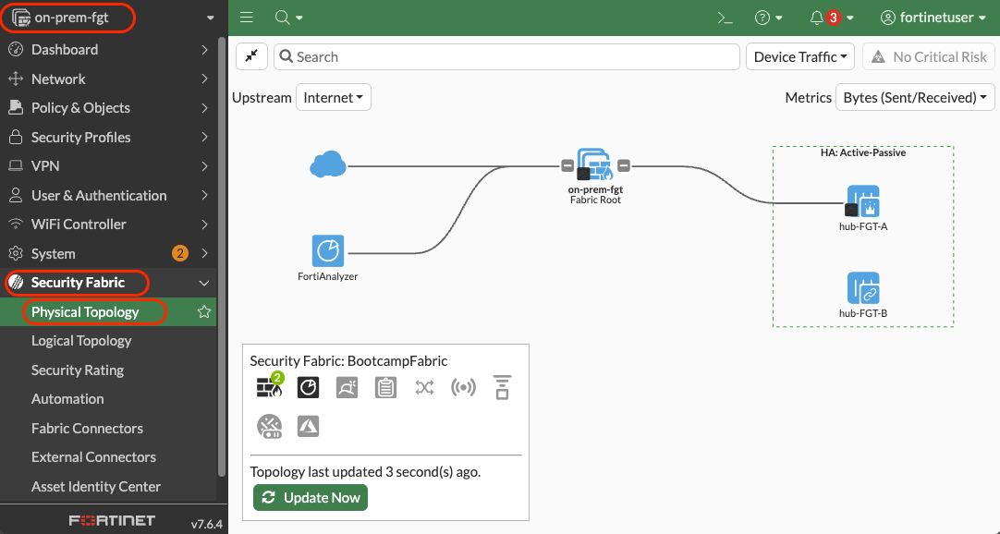

#### 7.2 Check Fabric Status on Leaf

1. In Azure FortiGate A, navigate to **Security Fabric** → **Physical Topology**
2. Verify fabric connection shows as **"Connected"**
3. Check that root device is visible

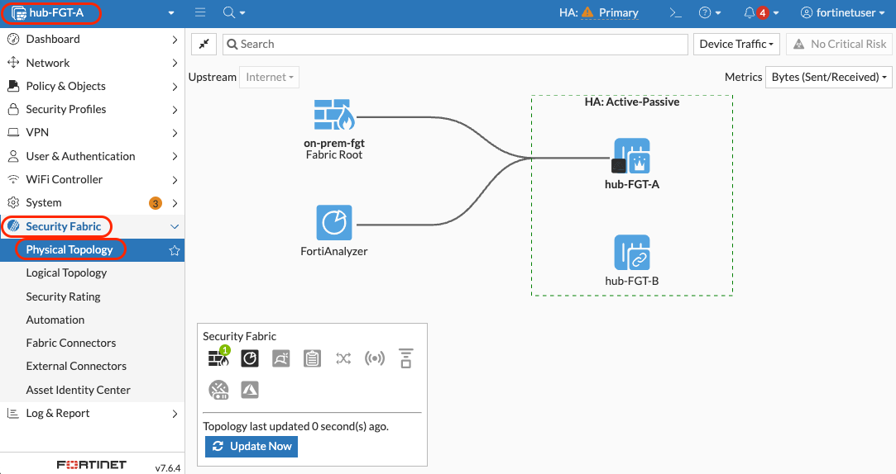

#### 7.3 Verify Logical Topology

1. Navigate to **Security Fabric** → **Logical Topology**
2. View the unified security architecture
3. Observe threat intelligence sharing indicators

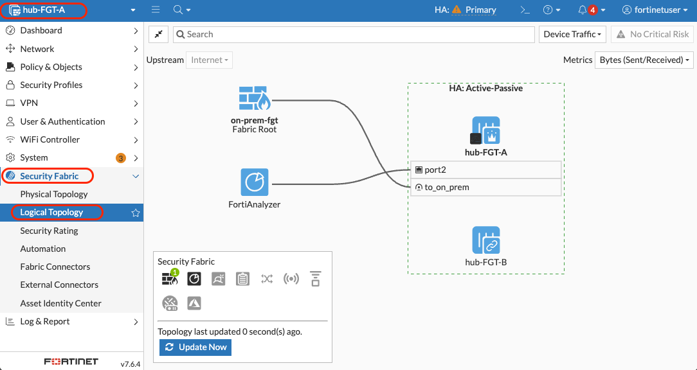

---

### Step 8: Test Fabric Functionality

#### 8.1 Shared Threat Intelligence

1. Navigate to **Security Fabric** → **Security Rating** in the on-prem Fortigate
2. View fabric-wide security posture
3. Check threat intelligence synchronization

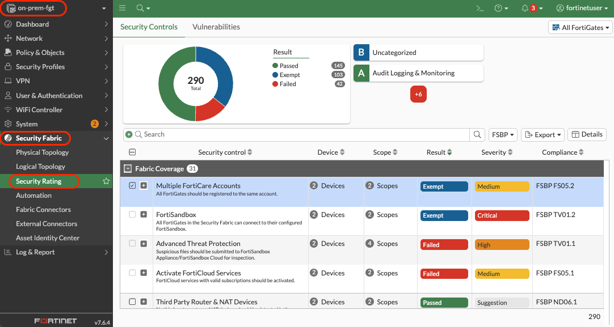

#### 8.3 Unified Log Correlation

1. Connect to **FortiAnalyzer**
2. Navigate to **Fabric View** → **Asset Identity Center**
3. Explore the widgets in the **Summary** tab

---

## Step 9: Advanced Fabric Features

### 9.1 Global Object Synchronization

1. Create a firewall address object on the root FortiGate
2. Enable **"Fabric Object"** option
3. Verify object synchronizes to leaf devices

### 9.2 Coordinated Security Policies

1. Create fabric-wide security policies
2. Test automatic policy coordination
3. Verify consistent enforcement across sites

### 9.3 Centralized Firmware Management

1. Navigate to **Security Fabric** → **Physical Topology**
2. View firmware versions across all devices
3. Plan coordinated firmware updates

---

## Verification Checklist

Before proceeding to Module 12, verify you have completed:

**VPN Interface Configuration:**

- [ ] Configured VPN tunnel interface IPs (10.100.101.1 and 10.100.101.2)
- [ ] Updated VPN address objects and groups
- [ ] Modified Phase2 selectors to allow all traffic
- [ ] Verified VPN tunnel connectivity

**Security Fabric Setup:**

- [ ] Configured on-premises FortiGate as fabric root
- [ ] Configured Azure FortiGate as fabric leaf
- [ ] Set up device authorization with correct serial numbers
- [ ] Configured SAML SSO for unified authentication

**Fabric Verification:**

- [ ] Verified fabric topology shows all connected devices
- [ ] Tested centralized device management
- [ ] Confirmed threat intelligence sharing
- [ ] Validated global object synchronization

---

**Fabric Benefits Achieved:**

- **Unified Visibility**: Single pane of glass across all sites
- **Coordinated Security**: Consistent policies and responses
- **Shared Intelligence**: Real-time threat information sharing
- **Simplified Management**: Centralized configuration and monitoring
- **Scalable Architecture**: Foundation for enterprise-wide security

---

## Troubleshooting Common Issues

### Issue: Fabric devices won't connect

**Solution:**

- Verify VPN tunnel is stable and established
- Check VPN interface IP configurations match
- Confirm serial numbers are correct in authorization list
- Validate network connectivity between fabric management IPs

### Issue: Authentication failures

**Solution:**

- Verify SAML SSO configuration matches between root and leaf
- Check admin profile permissions
- Confirm management IP addresses are reachable

### Issue: Objects don't synchronize

**Solution:**

- Verify "Fabric Object" option is enabled on shared objects
- Check fabric connectivity status
- Confirm upstream FortiGate IP is correct on leaf devices

---

## Next Steps

Once you've completed this module and verified Security Fabric connectivity, you're ready to proceed to [**Module 12 - FortiManager Deployment: Centralized Security Management and Policy Orchestration**](/modules/module-12-fortimanager/README.md)

FortiManager will integrate with the Security Fabric to provide enhanced centralized management, policy templates, and automated deployment capabilities.

**Estimated completion time**: 35-40 minutes

> [!NOTE]
> **Security Fabric Foundation**: This module establishes the foundation for enterprise-scale security management. FortiManager will build upon this fabric to provide even more advanced management capabilities.
