# Module 12 - FortiManager Deployment

## Centralized Security Management and Policy Orchestration

### Overview

FortiManager provides centralized management, configuration, and policy orchestration for all FortiGate devices in your security fabric. In this final module, we'll deploy FortiManager in the Azure hub network and configure it to manage both the Azure FortiGate cluster and the on-premises FortiGate, completing our comprehensive Fortinet Security Fabric.

### Learning Objectives

By the end of this module, you will have:

- Deployed FortiManager VM in the Azure hub network
- Configured centralized management for all FortiGate devices
- Created and deployed unified security policies across the fabric
- Explored FortiManager's configuration management capabilities
- Established a complete, centrally-managed security infrastructure

---

## Understanding FortiManager Architecture

### Management Overview

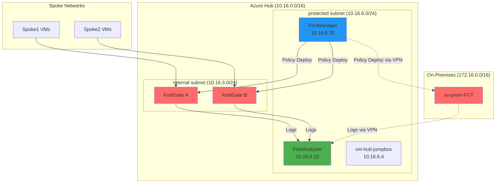
```mermaid
graph TB
    subgraph "Azure Hub (10.16.0.0/16)"
        subgraph "protected subnet (10.16.6.0/24)"
            FMG[FortiManager<br/>10.16.6.20]
            FAZ[FortiAnalyzer<br/>10.16.6.10]
            HUBVM[vm-hub-jumpbox<br/>10.16.6.4]
        end
        
        subgraph "internal subnet (10.16.3.0/24)"
            FGTA[FortiGate A]
            FGTB[FortiGate B]
        end
    end
    
    subgraph "On-Premises (172.16.0.0/16)"
        ONPREMFGT[on-prem-FGT]
    end
    
    subgraph "Spoke Networks"
        SPOKE1[Spoke1 VMs]
        SPOKE2[Spoke2 VMs]
    end
    
    %% Management flows
    FMG -->|Policy Deploy| FGTA
    FMG -->|Policy Deploy| FGTB
    FMG -.->|Policy Deploy via VPN| ONPREMFGT
    
    %% Logging flows
    FGTA -->|Logs| FAZ
    FGTB -->|Logs| FAZ
    ONPREMFGT -.->|Logs via VPN| FAZ
    
    %% Traffic flows being managed
    SPOKE1 --> FGTA
    SPOKE2 --> FGTB
    
    style FMG fill:#2196F3
    style FAZ fill:#4CAF50
    style FGTA fill:#ff6b6b
    style FGTB fill:#ff6b6b
    style ONPREMFGT fill:#ff6b6b
```

**FortiManager Capabilities:**

- **Centralized Policy Management**: Create and deploy policies across all devices
- **Configuration Templates**: Standardize configurations across the fabric
- **Device Provisioning**: Automated device onboarding and setup
- **Change Management**: Track, approve, and audit configuration changes
- **Firmware Management**: Centralized firmware updates and scheduling

---

## Step 1: Deploy FortiManager VM

### 1.1 Start FortiManager Deployment

1. Navigate to **`rg-hub-bootcamp`** resource group
2. Click **"+ Create"**
3. Search for: **`FortiManager`**
4. Select **"FortiManager Centralized Security Management"** by Fortinet
5. Click **"Create"**
6. Select **"Fortinet FortiManager - Single VM"**
   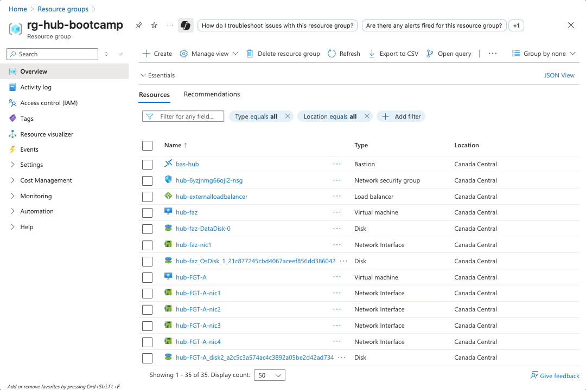

### 1.2 Configure Basic Settings

1. **Basics** configuration:
   - **Subscription**: Your subscription
   - **Resource group**: `rg-hub-bootcamp`
   - **Region**: `Canada Central`
   - **FortiManager administrative username**: `fortinetuser`
   - **FortiManager password**: Choose a strong password
   - **FortiManager Name Prefix**: `hub`
   - **FortiManager Image SKU**: `Bring Tour Own License or FortiFlex`
   - **FortiManager Image Version**: `7.6.3`

   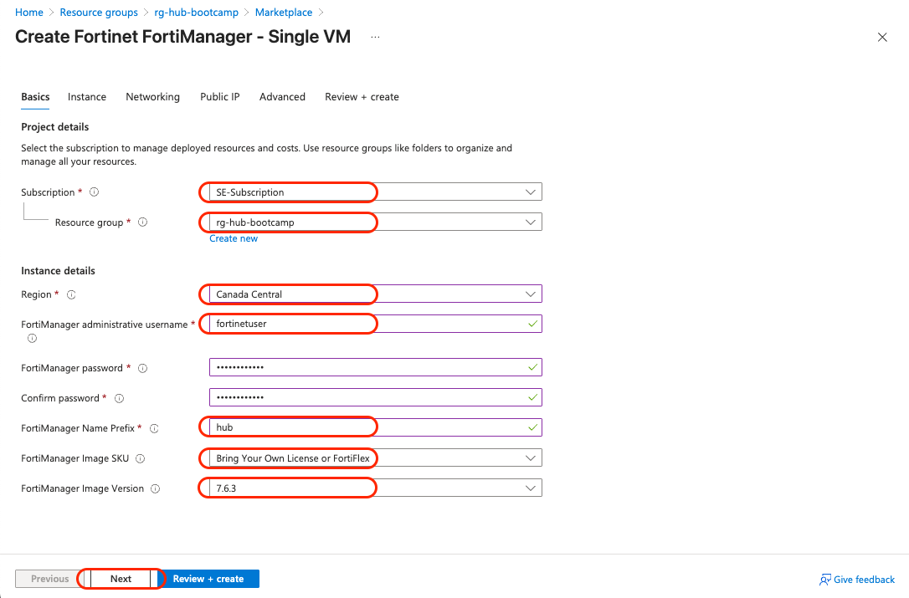

2. Click **"Next"**

### 1.2 Configure Instance Settings

1. **Instance**
   - **Instance Type**: `Standard_D4s_v5` (4 vCPUs, 16 GB RAM)
   - **Availability Option**: `No infrastructure redundancy required`

   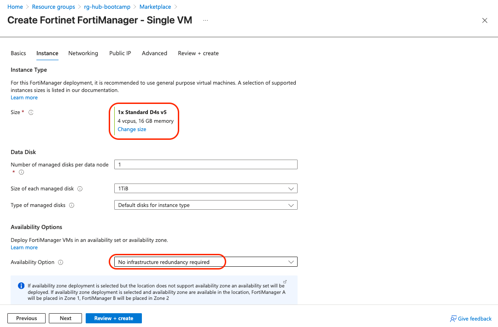

   - **My organisation is using the FortiFlex subscription service.**: `Enable`
   - **FortiManager FortiFlex**: Do not use any, we will load it later.
   - **Name of the FortiManager VM**: `hub-fmg`

   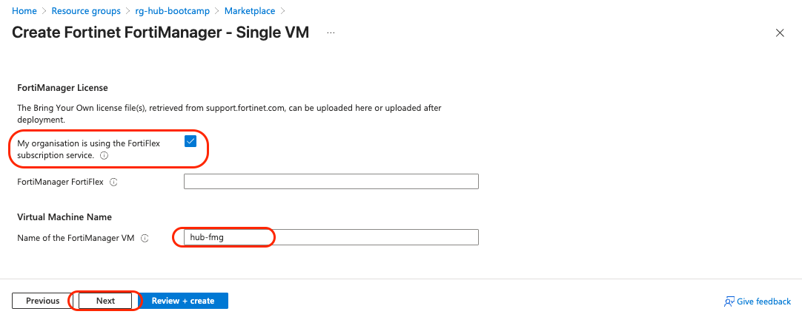

### 1.3 Configure Networking

1. **Networking** configuration:
   - **Virtual network**: `vnet-hub`
   - **Subnet**: `protected (10.16.6.0/24)`

   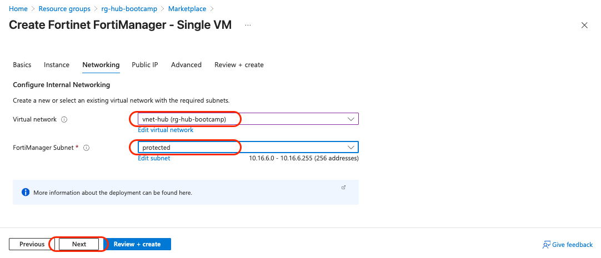

### 1.4 Configure Public IP

1. **Public IP** configuration:
   - **Public IP**: `None` (access via Bastion)

   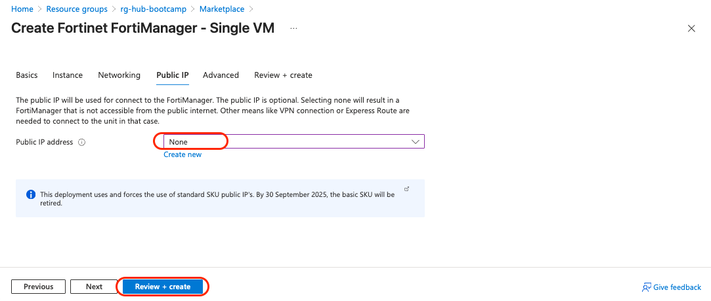

### 1.5 Deploy

1. Click "Review + create" then "Create"
2. Wait for deployment to complete (~5-10 minutes)
3. Click **"Review + create"** then **"Create"**

### 1.6 Wait for Deployment

FortiAnalyzer deployment typically takes 5-10 minutes.

---

## Step 2: Initial FortiManager Configuration

### 2.1 Load the license

1. Connect to **`vm-hub-jumpbox`** via Bastion
2. Open Command Prompt
3. Open a SSH session with FortiManager

   ```bash
   ssh fortinetuser@10.16.6.5
   ```

4. Run the command to load the FortiFlex license using the token gave to you by the instructor

   ```bash
   exec vm-license < FortiFlex token>
   ```

5. The FortiManager will reboot
6. Close the command prompt

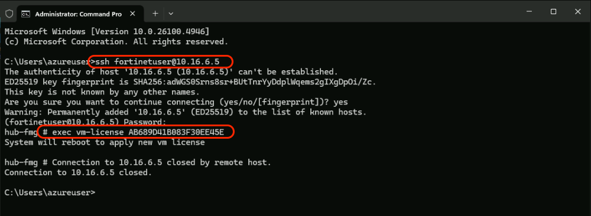

### 2.2 Access FortiManager

1. Connect to **`vm-hub-jumpbox`** via Bastion
2. Open web browser
3. Navigate to: `https://10.16.6.5`
4. Accept security certificate warnings

### 2.3 Initial Setup

1. **FortiManager Initial setup**

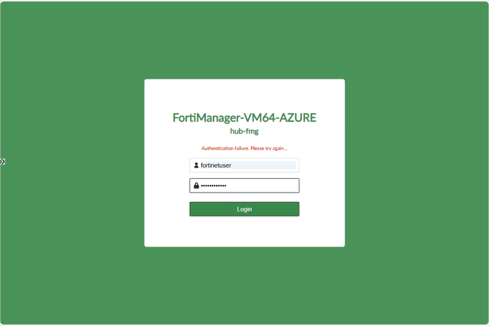

### 2.4 Basic System Configuration

1. **System Settings > Settings**:
   - **Idle timeout (GUI)**: `3600` Seconds (1 hour)
   - **Theme**: `Graphite`

   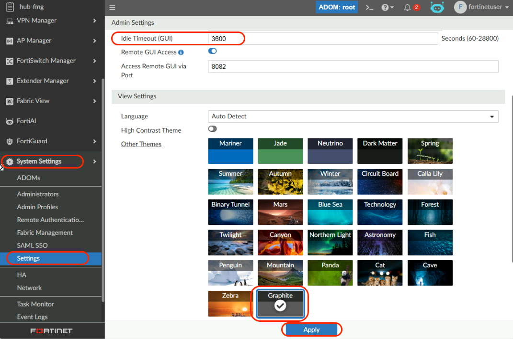

---

## Step 3: Add FortiGate Devices to FortiManager

### 3.1 Adding VM devices

By default, FortiManager does not recognize VM serial numbers. This applies to:

- FortiGate-VM
- FortiCarrier-VM
- FortiProxy-VM
- FortiFirewall-VM

This measure increases security of the FortiManager system by ensuring that VM devices can only be added to FortiManager when recognition of VM serial numbers has been enabled by an administrator.

If you attempt to add a VM device (for example FortiGate-VM) to FortiManager while the `fgfm-allow-vm` command is disabled, an error will appear indicating that **VM devices are not allowed** or that the **device is an unsupported model**.

When upgrading from an earlier version of FortiManager that does not enforce this behavior, VM devices already managed by FortiManager will continue to be supported without interruption, but you must enable the `fgfm-allow-vm` command before you can add any additional VM devices.

1. To add a FortiGate-VM to FortiManager: In the FortiManager CLI, enable recognition of FortiGate-VM serial numbers:

   ```console
   config sys global
       set fgfm-allow-vm enable
   end
   ```

   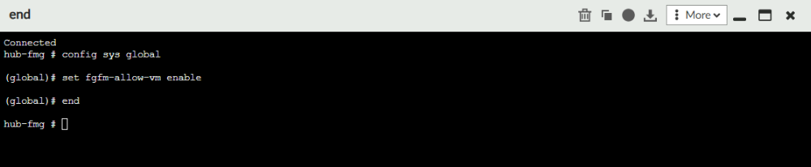

### 3.2 Add the FortiGate on-premise

1. Go to **Security Fabric > Fabric Connectors**, then click on Central Management Settings

   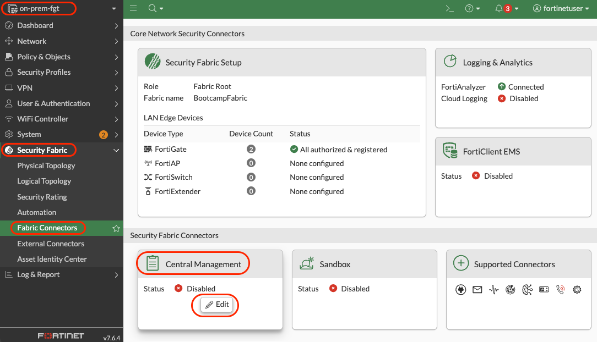

2. Click **Edit**
   - **Status**: `Enabled`
   - **Type**: `On-Premises`
   - **Mode**: `Normal`
   - **IP/Domain name**: `10.16.6.6`

   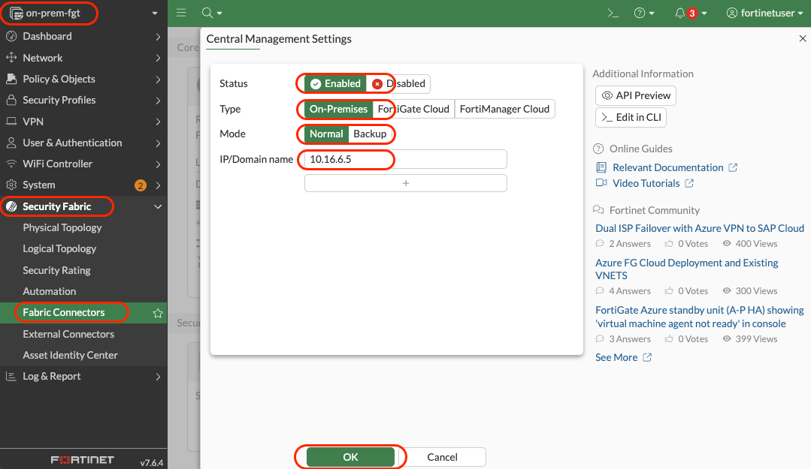

3. Accept the FortiManager serial number and certificate

   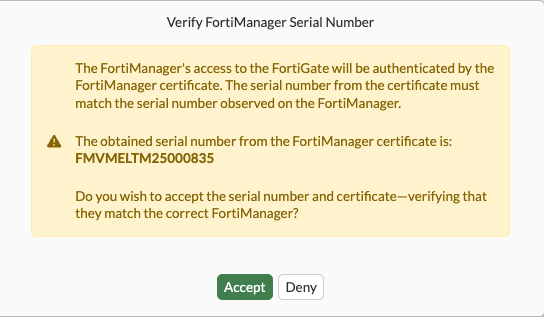

4. Request sent and received: now the FortiGate needs to be authorized in the FortiManager.

   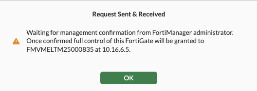

>[!NOTE] Because the Security Fabric is configured, once you add the FortiGate on-premise (root) to FortiManager, the FortiGate on Azure is automatically added as well.

### 3.3 Authorize Devices in FortiManager

1. From the jumpbox, open Microsoft Edge
2. Navigate to: `https://10.16.6.5`
3. Navigate to **Device Manager** > **Device & Groups**
4. Click **"Unauthorized Devices"**
5. Select the all FortiGate devices
6. Click **"Authorize"**

   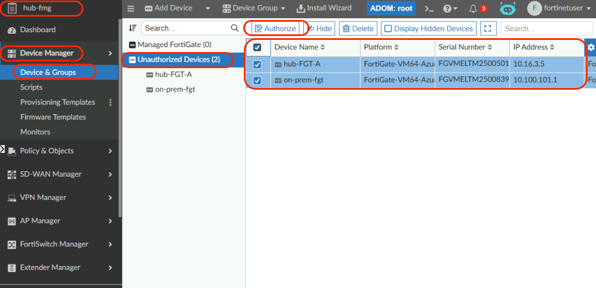

7. Click **"Ok"** in the **"Authorize Device"** window

   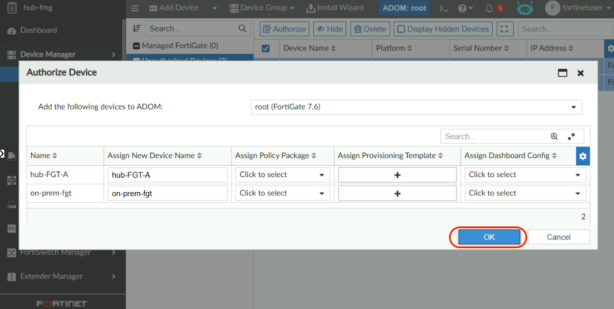

### 3.4 Verify Connection Status

1. Wait a few minutes for connection establishment
2. Refresh the FortiManager page
3. Verify connection status shows as connected

   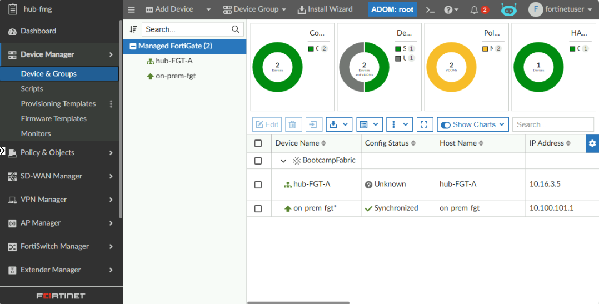

4. Return to the FortiGate and check **Security Fabric** → **Fabric Connectors** for connection status

### 3.5 Verify FortiGate on-prem for Management

1. Access FortiGate on-prem management interface
2. You should see a message informing that this FortiGate is managed by FortiManager.

   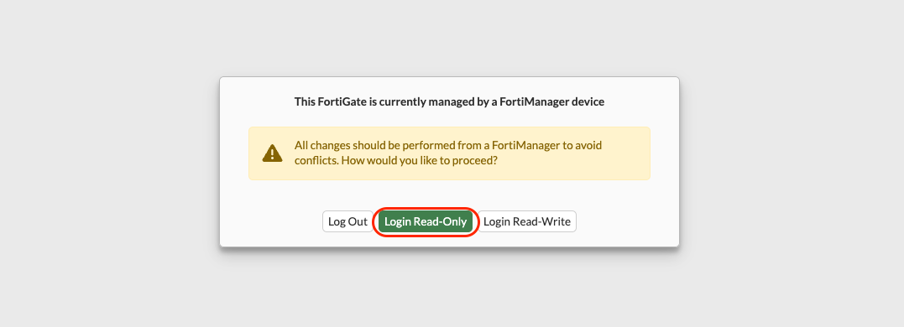

3. Click **Login Read-Only**
4. Navigate to **Security Fabric** → **Fabric Connectors**

   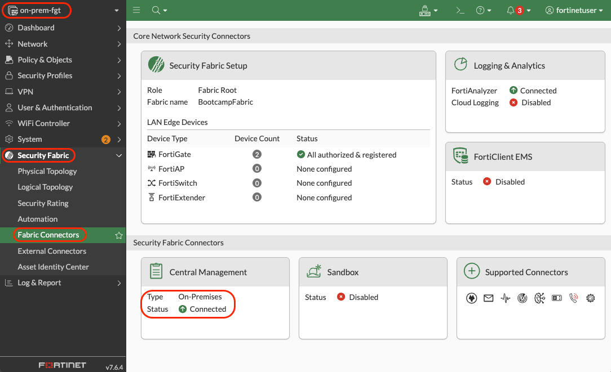

### 3.6 Verify Hub FortiGate A for Management

1. Access hub FortiGate A management interface
2. Login with your `fortinetuser` username and your password

   

3. You should see a message informing that this FortiGate is managed by FortiManager.

   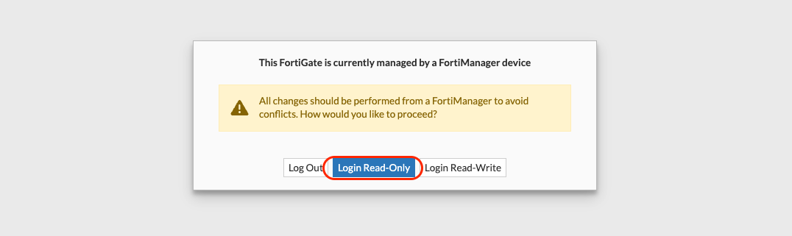

4. Navigate to **Security Fabric** → **Fabric Connectors**

   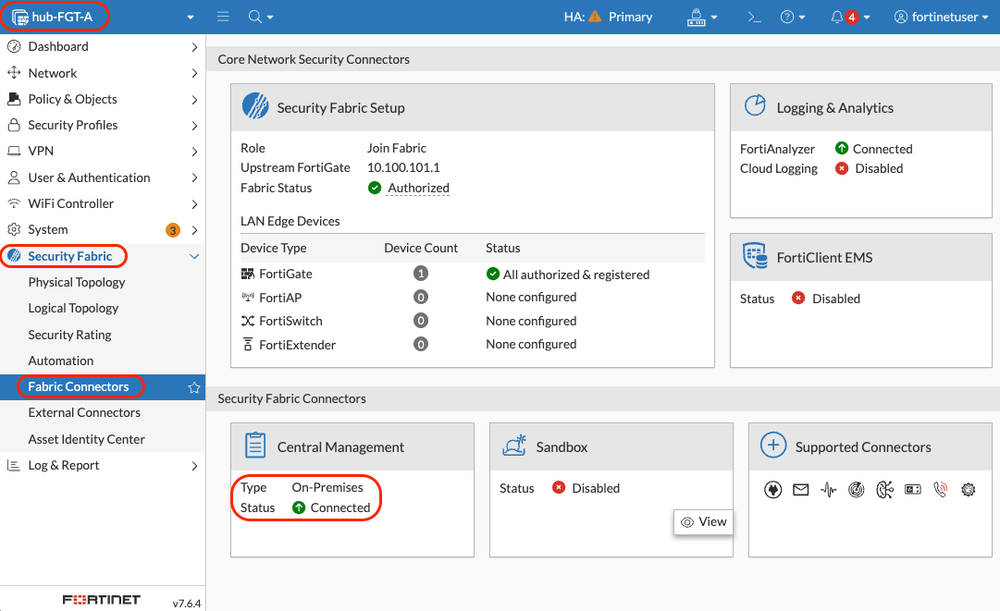

### 3.7 Verify Hub FortiGate B for Management

1. Access hub FortiGate B management interface
2. The login process is similar to Fortigate A
3. Navigate to **Security Fabric** → **Fabric Connectors**

   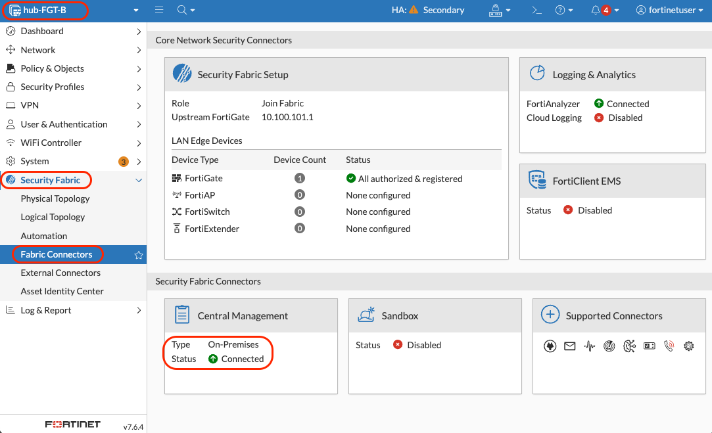

---

## Step 4: Manage Devices in FortiManager

### 4.1 Import Device Configurations

1. For each device, right-click → **"Import Configuration"**

   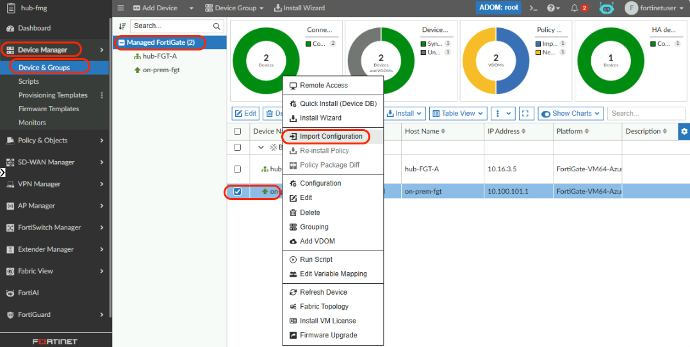

2. This imports existing configurations into FortiManager

   - For the importing, let's use all default options
   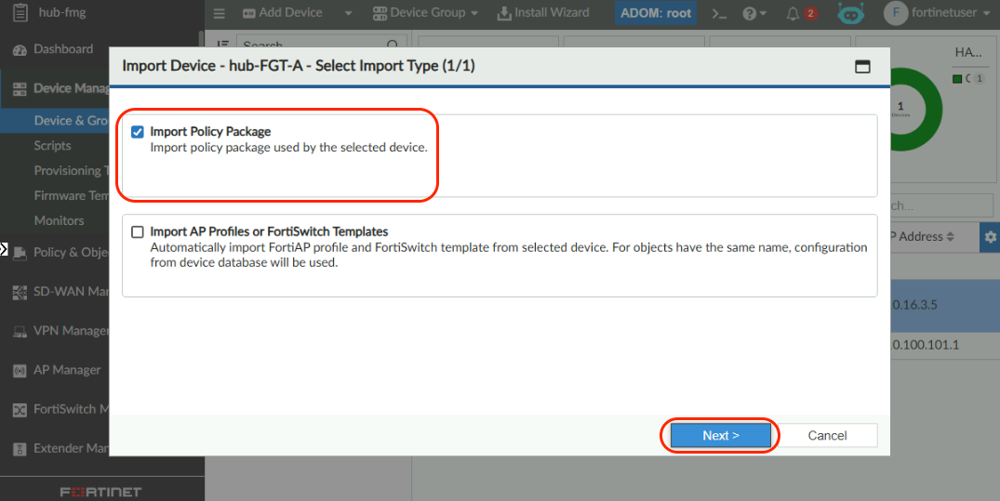
   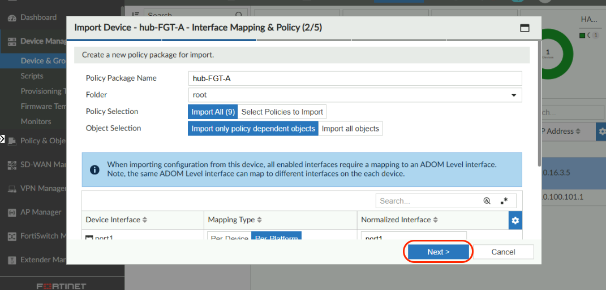
   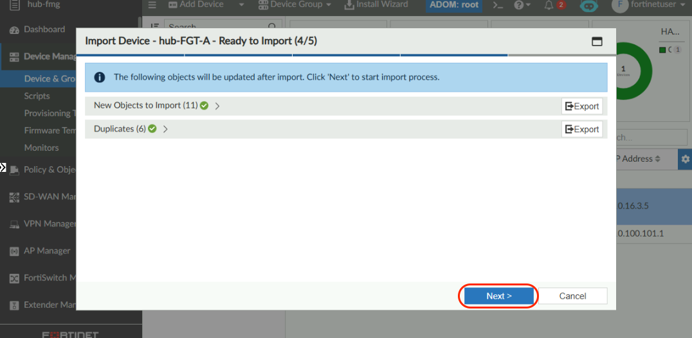
   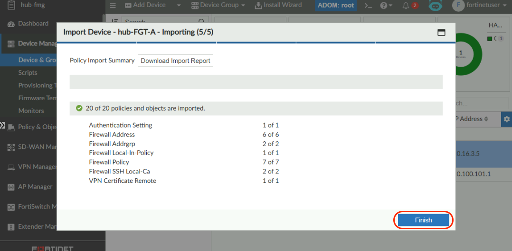

3. Review imported policies under **Policy & Objects** > **Policy Packages**

   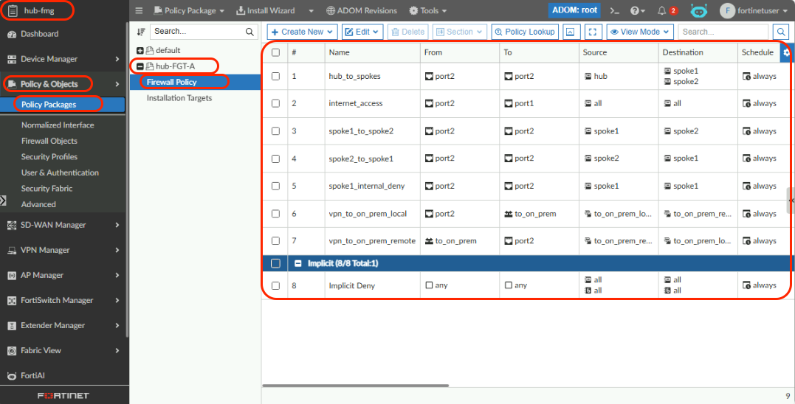

---

## Verification Checklist

Before completing the bootcamp, verify you have accomplished:

**FortiManager Deployment:**

- [ ] Deployed FortiManager VM
- [ ] Completed initial setup and admin password configuration
- [ ] Configured timezone and system settings

**Device Management:**

- [ ] Registered all three FortiGates with FortiManager
- [ ] Organized devices into logical groups
- [ ] Imported existing device configurations

---

## Architecture Review - Complete Security Fabric

After completing all modules, your comprehensive Fortinet Security Fabric should look like this:


**Complete Security Fabric Features:**

- **Centralized Management**: All policies deployed from FortiManager
- **Unified Logging**: All traffic and events logged to FortiAnalyzer
- **High Availability**: Azure FortiGate cluster with automatic failover
- **Hybrid Connectivity**: Secure VPN between on-premises and cloud
- **Micro-Segmentation**: Granular control over all traffic flows
- **Zero-Trust Architecture**: All traffic inspected regardless of source/destination

---

## Congratulations

You have successfully completed the **Fortinet Security Fabric Azure Bootcamp**!

### What You've Accomplished

1. **Built a comprehensive hybrid security architecture** spanning on-premises (simulated) and Azure environments
2. **Deployed high-availability FortiGate clusters** with proper load balancing and failover
3. **Implemented centralized logging and analytics** with FortiAnalyzer
4. **Established centralized management and policy orchestration** with FortiManager
5. **Created secure site-to-site connectivity** with IPSec VPN tunnels
6. **Configured advanced networking** with hub-spoke topology and user-defined routes
7. **Applied zero-trust security principles** with comprehensive traffic inspection

### Next Steps (if you are brave enough!)

- **Security Profiles**: Configure IPS, AV, Web Filtering, and Application Control
- **High Availability Testing**: Validate failover scenarios and recovery procedures
- **Performance Optimization**: Tune FortiGate sizing and accelerated networking
- **Compliance Reporting**: Set up automated compliance and audit reports
- **Disaster Recovery**: Implement backup and recovery procedures for all components

Or you can clean up all the resources used in this bootcamp by following the steps in [**Module 13 - Environment Cleanup: Removing All Bootcamp Resources**](/modules/module-13-cleanup/README.md)

### Thank You

This bootcamp provided hands-on experience with enterprise-grade security infrastructure. The skills and architecture patterns you've learned are directly applicable to real-world deployments.

**Estimated completion time**: 40-45 minutes

---

## Final Architecture Summary

Your completed environment includes:

- **3 Resource Groups**: Hub, Spoke1, Spoke2, On-Premises
- **6+ Virtual Networks**: Hub, 2 Spokes, On-Premises with proper peering
- **5 FortiGate Instances**: 2 Azure HA cluster + 1 on-premises
- **2 Management VMs**: FortiAnalyzer and FortiManager
- **6 Workload VMs**: Windows and Linux across all environments
- **Complete Security Fabric**: Centralized management, logging, and policy enforcement
